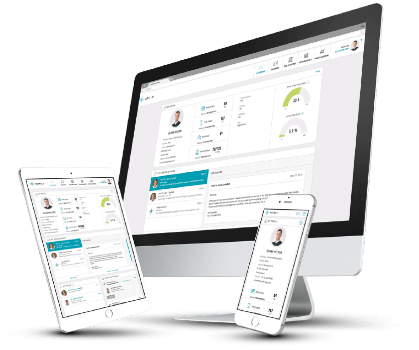

## Introduction

In the last couple of years, we - as a relatively young IT company starting in the health IT field - have gone through
several stages of interoperability. These stages were roughly:

(1) we don't need interoperability (we were set straight);

(2) we know everything (we were set straight);

(3) we can have others do interoperability for us (boy, were we set straight);

(4) we need to be interoperable;

(finally, 5) we need to be interoperable but pragmatic with it at the same time.

So how did we maintain great user experience and user engagement while trying to plug and play other systems?

## The value behind the pragmatic approach

We stuck with the use-case and value-first approach and leveraged interoperability only when it would benefit our users.
Based on the problems we were solving, we started thinking about how data coming from other systems or data going to
other systems would help the user, the client and other applications or systems living in the ecosystem. We didn't have
strong points or strong beliefs about any standard, and while we offered our expertise, we mostly complied with whatever
was required wherever we were trying to "plug in" our solutions. XDS? Sure. FHIR? Okay. HL7v2? Let's do it (opening one
big old can of wo...-).

This mantra we have - unknowingly - adopted resulted in two things:

(1) having a user-first and value-based approach, our applications are really intuitive and user-friendly, don't have
pitfalls and aren't hindered due to interoperable requirements;

(2) pragmatism and leniency when it comes to which health IT standard we support resulted in the fact that we have built
a really strong interoperable platform. Strong both in terms of the variety of standards we support as well as (or
perhaps even more important) the option to stretch, configure and adapt to just the right flavour of standards that
others have supported.

## Standard-ish standards

No implementation of a standard is the same, however weird that sounds. While it can be argued to be the same on a
technical level - and that's mostly covered with written documentation, trial implementations and profiles. The one
phase of interoperability we can almost guarantee won't be the same is the semantic part. The content part. The "oh my
god, I'm going to write my age in a body height data point" case. I know - people are forced to act this way when
limited by software vendors and are looking for workarounds. This most often results in standard-ISH implementations -
but it makes integrating with such solutions no less painful (and sometimes I think they are just doing it on purpose to
mess with me).

Accepting that unwritten rule of the health IT world, we started doing just that - being pragmatic when it comes to
being compliant with a standard to the last letter and, at the same time extracting the pieces into configurable
low-code components that can be configurable by "anyone" at "any point of time" - no more long development hours trying
to cover every single version of the devil's implementation of the standard, no more long DevOps cycles to release and
deploy a new version of the software, no more QC cycles of our (very.. oh my god how very) thorough QC team.

## Low-code adaptability of our platform – in practice

While this indirectly benefits anyone using any of our frontend solutions or our IHE components (XDS, MPI, ..), the most
noticeable implementation of this is our SMART on FHIR context launching mechanism. Due to the nature of the DDMN
project and the variety of vendors, it includes, we made the context launching of our MDT solution fully configurable.
The beauty behind all of this is that although restricted by FHIR, the flavour of FHIR, the version of FHIR, the "yeah
but we put Patient's heart rate in the PaymentNotice field" content-specific part of FHIR - we can adapt to all of that
purely with configuration. With that, we have made the solution 100% scalable throughout the Netherlands and made our
solution context-launchable by any vendor and any version of the vendor's EMR (because, yes - even two same EMRs don't
speak the same language). For the more technical-minded of you, stay tuned. A more detailed post on how we've achieved
this will follow.

## Parsek's mantra that allowed all this

While we are now directly involved in standardising national profiles (albeit the content part), we never positioned
ourselves on the one side of any health IT standard. As developers, we never joined a cult. We did implement some with
more enthusiasm than others, but we took a pragmatic approach and adapted to whatever the ecosystem required. We never
took these decisions personally. And I think that's key and that gives our Vitaly platform a significant advantage and
made it possible for us to switch when a switch made sense. Why? Because every standard has its place in the world.

## The trap of interoperability

FHIR isn't the best for persistency and openEHR isn't the best for transfer... And XDS isn't the best for structured
data..., and HL7v2 isn't good for...well..your health. When your only tool is a hammer, you tend to see every problem as
a nail. And that clouds your judgment when designing scalable solutions, and you may very quickly find yourself in a
downward spiral trying to find your way out. But it's hard to climb out because... Well... You only have a hammer.
Luckily, we successfully avoided this trap of interoperability and are now reaping the benefits of good decisions we've
made along the way.