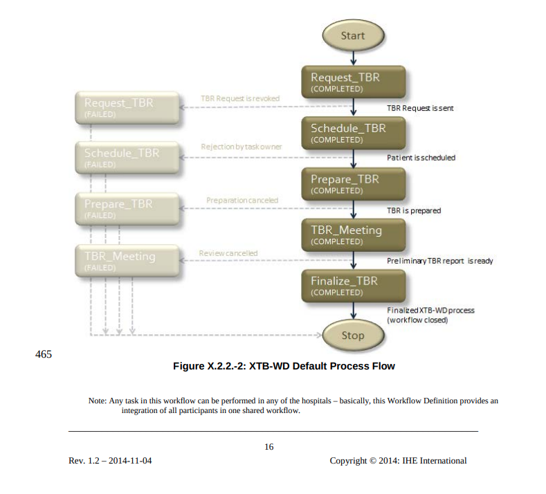
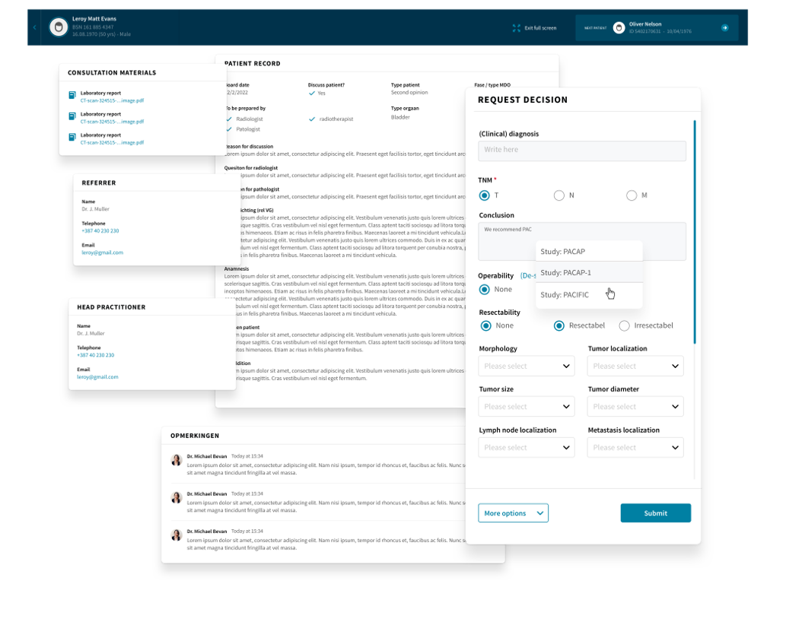
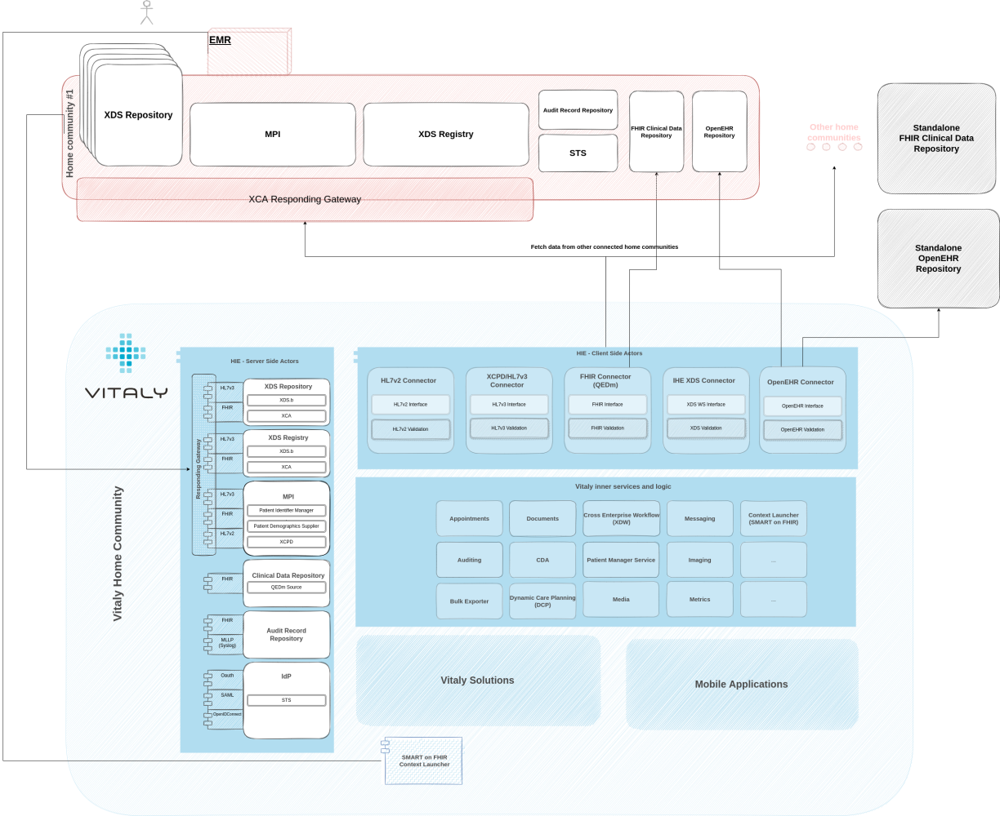

## Introduction

I’ve posted a piece on the [pragmatism of interoperability](../pragmatic-approach-interoperability) a couple of weeks
ago where I outlined what approaches we took
at the [Open Line Vitaly](https://www.linkedin.com/company/openlinevitaly/?lipi=urn%3Ali%3Apage%3Ad_flagship3_pulse_read%3B3g32dQJ0QsOeSgsQPisA%2Bw%3D%3D) to avoid the rabbit hole one can get themselves into when building interoperable solutions (
often with the sole purpose of interoperability). And the path we were on positioned us on the market quite nicely with
the configurable and low-code platform that we have now.

This article is a bit less about that - about how data exchange is happening with other systems - and a bit more about
the value of data and what we can achieve with it.

## The data is there, lets use it

Let’s assume the data is there - most often than not it is now connected, integrated and seamlessly shared between
different systems. This is what we achieved on a technical (arguably also semantical) level with open standards, with
profiles, with frameworks and initiatives. But now that we have that, the next phase of the "evolution" is to make sense
of that data.

A holistic approach with the data being used as a foundation stone we can now build use-case driven solutions on. All to
improve quality of care, make collaboration feasible and have patients benefit from everything that the data makes
possible now. You have the data. You have your software. You know market’s requirements. The world is your oyster! (well
as long as you conform to security restrictions, GDPR, audit considerations, consent modelling, .. but as I said:
oyster!).

So what did we do? A lot. And then we pivoted. And made a version two… and pivoted again. A couple of such moves later,
we have two main solutions on the market actively used by clinicians in different regions in the world – Coordinated
Care and Collaborative Decision Making.

## Collaborative decision making enabling effective cross-specialist MDT discussions

Collaborative Decision Making or a (how I and everyone else except our marketing team calls it) “Multidisciplinary Team
Meetings (MDT) application” is a solution that enables clinicians from anywhere to participate in online tumor boards.

It follows the IHE specified XTB-WD, which is short for “many different phases all with clearly defined inputs and
outputs which at the end result in a patient to be holistically and thoroughly discussed on a board”, meaning clinicians
from very different specialities can participate (online!), prepare, review relevant documentation, write notes, minutes
of meeting, final report, etc. All with the help of a very intuitive user interface that guides users through the
otherwise quite complex workflow definition.

Data coming from other systems obviously gives meaning to such a solution. Without it, there would be very little to
prepare on, much less to discuss on the board. Obviously users could manually create patients and manually upload
clinical documentation they had previously downloaded from their systems, but that’s such a.. 2020 thing. We live in the
future now. Data automatically presents itself now (integrations & open standards ftw).

## Interoperable capabilities

Other than that, interoperable capabilities of our platform allow this to be very tightly and seamlessly integrated to
existing EMRs that clinicians are so very locked-in..- I mean: fond of using. The solution can be context launched from
within their familiar software; some clinical data can even be transferred directly to our solution (SMART on FHIR)
which opens in the same context that the user had within the EMR. It’s not too far fetched to say that step one or two
of the process is done within one software and the rest of the flow is done using our solution. It’s what data, open
standards and interoperable capabilities of all vendors enable us to do. Seamless and in-sync functioning of multiple
systems, empowered end-users, all to enable best outcomes for patients.

That’s in short one use-case we’ve covered and really thoroughly used data available to us, while at the same time
publish clinical data produced as a result of that process to the healthcare information exchange (or rather we make it
available in our standard compliant XDS registry and structured CDR QEDm, thus enabling whoever else to do whatever else
his mind desires).

## Empowering professionals and patient users through Coordinated care

The other solution is the Coordinated Care solution with a pinch of the Vitaly Patient (patient facing application).
I’ll let the video (from 2:00) do the talking here.

Essentially, it’s a solution that enables a holistic approach to patient’s treatment and follows progress on a path that
a disease put them on. Patient-facing app integrated with application for care teams keeps the patient highly engaged,
less frustrated and on top of their care pathway activities while being safely monitored from the distance.

With the underlying Dynamic Care Planning (DCP) IHE profile, it gives interoperable possibilities even to third party
applications that’d want to interact or be part of the pathway.

It’s another excellent use of the data the open standards make possible and fully empower both professionals as well as
patient users.

## THE Vitaly platform

These were all frontend facing solutions built around use-cases that give our platform and data meaning. Underneath it
all, there’s a strong foundation. A strong interoperable core.

Auditing service to ensure an audit trail of everything that is going on. Context launching capabilities. IdP
capabilities that make NHS Login or DigiD integration possible. DCP service for the care planning. XDW service for
support of the workflow module. Master Patient Index to ensure proper patient management. Messaging, appointments,
metrics, FHIR compliant CDR (QEDm), XDS, OpenEHR, HL7v2, HL7v3, …..

Underneath it all, there’s a foundation that - while frontend solutions were trying to find themselves and kept on
pivoting – grew stronger, kept on improving and bulking-up. It became something that is now purely with configuration
and low-code adaptability able to cater to a variety of different needs in the ecosystem. And most importantly, the
foundation is now something that enables our frontend solutions to take “data” for granted. **To only care about doing
what’s best for the patient. To give the data meaning and purpose.**