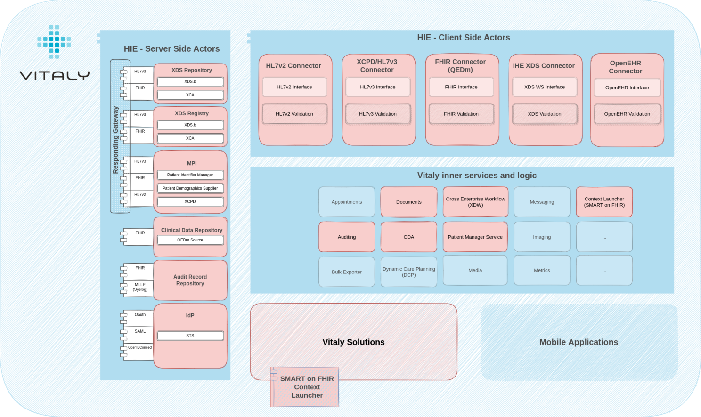
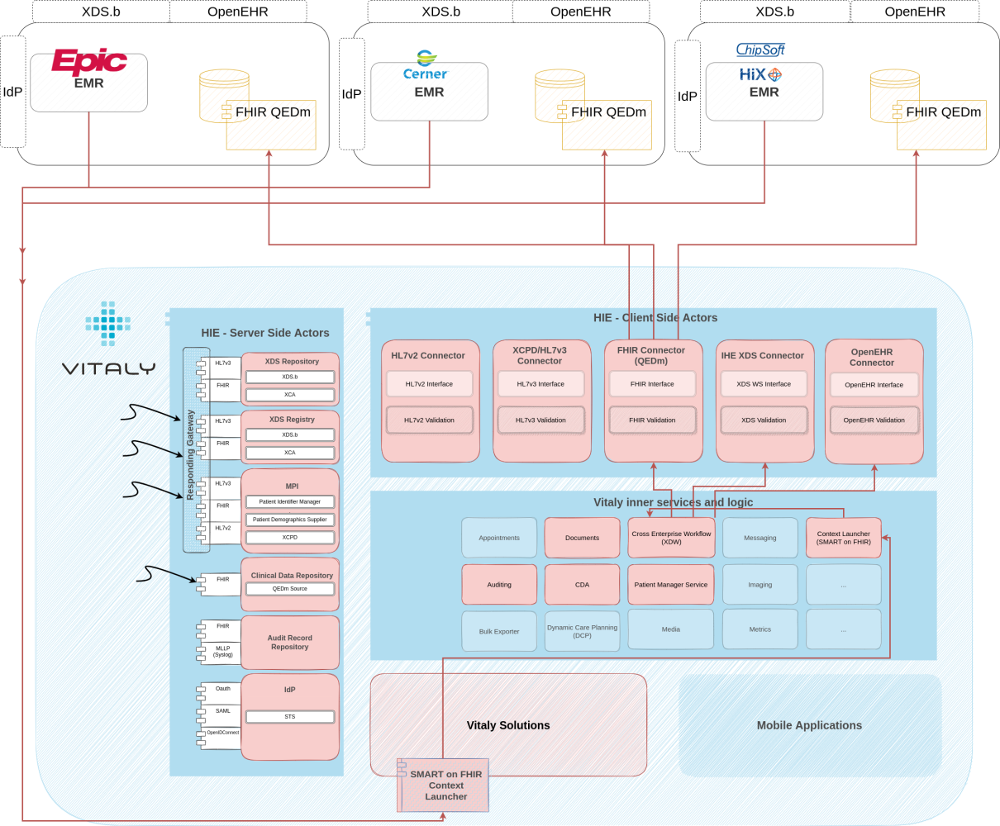
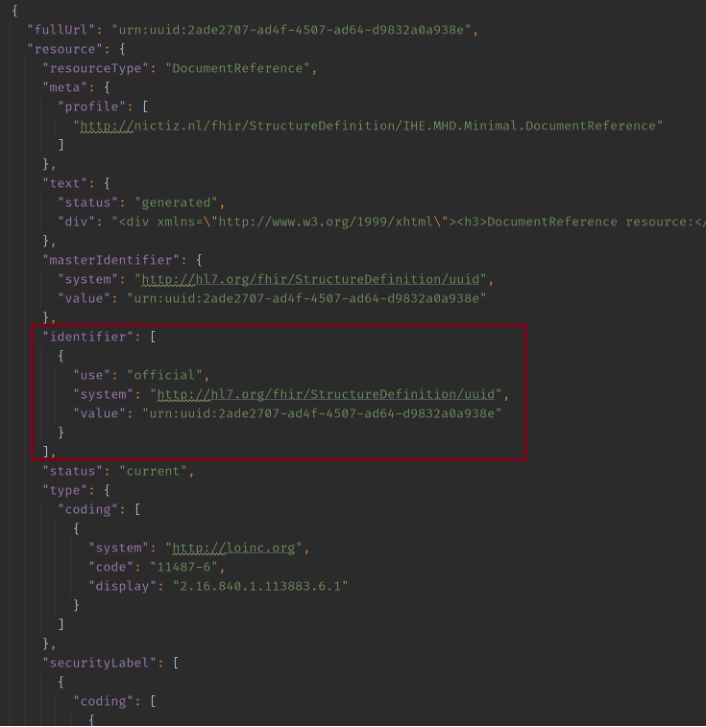
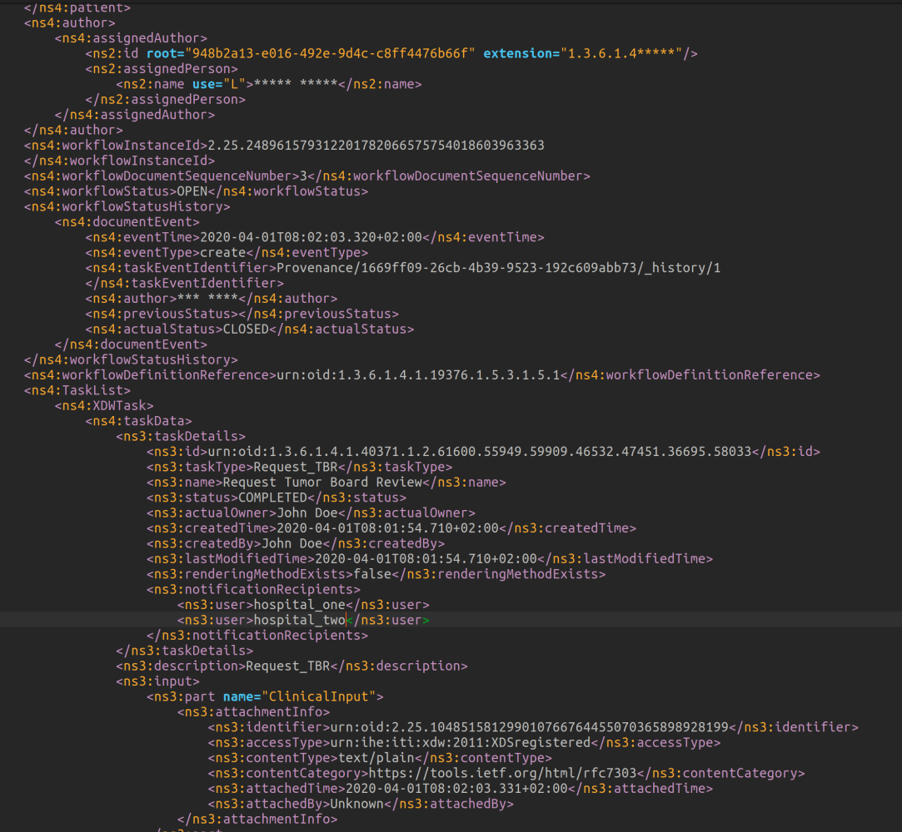

## Introduction

In my [previous post](../data-first-use-case-driven-interoperability/), I briefly introduced two main Vitaly solutions offered by [Open Line Vitaly](https://www.linkedin.com/company/openlinevitaly/?lipi=urn%3Ali%3Apage%3Ad_flagship3_pulse_read%3B3g32dQJ0QsOeSgsQPisA%2Bw%3D%3D). From the use-case
perspective, that is. I tried to minimize the technology and interoperability part to the minimum just to stress the
fact that when data is made available and “taken for granted”, magical things can happen.

Now let’s look at all of this from the other side. What are the wheels that power all of this? How does interoperability
look like in the background and how are profiles, standards and frameworks followed to ensure privacy, security,
scalability and empower the end user to the maximum?

## Meet the Vitaly Platform

Below you can see the Vitaly Platform. Something that each of our frontend solutions relies on and something that powers
the whole thing. Marked red are modules that play a part in the MDT solution – be it based on our users’ actions or
other systems participating in the whole infrastructure.

Perhaps a quick summary of what our MDT solution is and what it does. Using it, clinicians can prepare MDT requests and
perform the whole MDT process with it:

1) Request phase, where a certain hospital is preparing clinical documentation to support the MDT (including attaching
relevant clinical documents and structured data),
2) Scheduling phase, where the information in the case requested can be reviewed, confirmed for the MDT conference or
rejected based on more information required.
3) Preparation phase, where all participants have the relevant clinical documentation made available to review it and
prepare for the board,
4) Meeting itself (virtual ‘call’) and
5) Finalization phase is where the documentation of the MDT itself is created and shared among all involved in the MDT
meeting.

Now let’s jump into how it behaves, what interoperable components it has and how they interact with other systems.

## Context launching – What is it?

Quite a magical thing can happen at the request phase in terms of interoperability. For we have supported a context
launch (opening an app within an app)!

Something that in the eyes of software developers and architects in other industries may find an extremely dull and
outdated way of integration, but in the health-it, it’s the next big thing (some may find this sad).

**It represents two things:**

* a way of how users used to a certain software can continue using it and don’t need to switch between different
applications (SSO implied, context transferred, ..)
* and it also presents a compromise that these big vendors took between the vendor lock-in phenomenon and a fully
interoperable and open platform – and I’m willing to be OK with that compromise (for a year or so).

**So, what’s the context launch?**

As said, users can continue using whatever EMRs they’re fond of – Epic, Easycare, Cerner, Hix, .. you name it. If you’ve
been using it for decades, I understand it would be hard to switch. And you don’t need to.

You can find and view the patient within your EMR, gather all clinical documentation relevant for the MDT and do
everything to prepare yourself and the request for the tumor board.

When you’re ready to continue with the flow and submit the request, you can launch our Vitaly right from that soft and
cosy place of yours.

**Magic that happens now:**

* The user is automatically logged-in because of the identity brokering and SSO setup – no need to type any credentials
in.
* The patient is read from the EMR’s registry and presented within Vitaly – no need to find the exact patient again and
open it.
* All clinical documentation and the whole request form (tens of question-answers) is obtained from the EMR’s clinical
data repository and automagically filled in – no need to manually type in anything (again). You’re presented with a
fully filled request and with already attached clinical documentation. As I said, magic.

All of this is done by following the **SMART on FHIR** framework which in a detailed way describes how context should be
passed, how security and access control are enforced and in what way the IdP and FHIR CDR can be tightly coupled.

Our platform is fully compliant in that aspect which is great for scalability throughout different regions and among
many different EMR vendors (and even different EMR versions).

Luckily, as it turns out, it’s a framework widely adopted by them, and we’ve been able to integrate it with Epic,
Easycare & Cerner. Chipsoft (HIX) uses a bit different way of authentication, but the resolve of the context is very
similar to the SMART on FHIR.

## XDS to the rescue

Non-structured clinical documentation, there is still a lot of those. We can act like there isn’t and we can be sad
about that – but we can’t ignore it. Not when you’re integrating your software into an existing decades-old architecture
where even HL7v2 is still very much alive, let alone XDS.

So having XDS source and consumer available to jump in where there is no (available) alternative is a hard requirement.
In the case of this setup, XDS integration is mostly happening in three ways:

1) Much of the relevant clinical documentation is non-structured and available only in XDS. Even if it’s part of the
request phase resolved through the SMART on FHIR, it references an XDS document (and not a FHIR document).

1) As per the XTB-WD specification, all phases of the MDT have defined outputs – whether these are structured or not is not
part of the profile, but due to other systems in the architecture, it’s often a requirement that these documents are
available to everyone (perhaps most importantly to the hospital that is the author of the request/MDT) and the easiest
way for everyone to do that is to put it in the XDS. We have our own XDS Registry and Repository as part of our Platform
so that’s covered there.
2) Similarly to the above – but important enough for it to get its own point – is the final report of the MDT. This is
pretty much the whole summary of the tumour board and includes all relevant information that was discussed together with
conclusions. This too needs to be made available to everyone…this too ends up in XDS.

## How does the importance of MPI differ?
**Even though the user interface and experience of clinicians using our solutions is really amazing, shockingly, in the
end, it’s all about the patient.**

The master patient index is always there, but depending on other systems, the region the systems are in, the country the
region is in, the planet the country is in, … the importance of the MPI can differ significantly.

* It could be there to hold only patient identifiers.
* It could also be there to hold patient demography.
* It can happen that it holds multiple patient records of the same patient.
* Or multiple patient records of multiple patients within multiple hospitals.
* Perhaps it happens that it holds less than one record of a patient (just kidding, this is where we draw the line, this
can’t happen – I hope).

In any case – we have an MPI that supports all v2, v3, FHIR and XCPD facades. It can be used only by us or by others as
well. It can act as an EMPI and it can also be set up to perform a complex matching algorithm or a really simple one.

There is no simple story when it comes to MPI and patient matching. And it does require a completely separate blog post.
Or multiple of them.

## Advantages of the Cross Enterprise Workflow

The process that’s happening behind the curtains follows the XTB-WD IHE profile and produces an XDW Workflow Document
every step of the way. Arguably, this affects everything and quite often makes everything (unnecessarily?) complex.

But at the same time, it has at least two advantages:

**Access control** – if security considerations allow this, it’s very elegant to do access control based on the XDW
document.

I’ll try to explain how: multiple hospitals participate in an MDT. Hospitals, where some patients aren’t even
registered, can participate in patients’ MDTs and therefore don’t necessarily have consent to view patient documentation
that resides within other hospitals’ backbone.

Using the XDW Workflow Document, you can implement implicit consent for the time of the MDT. Meaning that if a clinician
from the hospital wants to see a patient’s documentation, the following criteria need to pass:

* clinician needs to come from an organization that is participating in the MDT
* clinical documentation that the user is “trying to access” needs to be directly attached to the MDT

**Both these pieces of information are available within the mentioned XDW Workflow Document.**

Scalability, integration options & history of the process – just like with any other standard you’re following, this too
makes it possible to scale through other regions and with different vendors in setting up a common MDT process.

Additionally, the profile “instructs” you to keep an XDW Workflow Document for every change that happens so you have a
really nice and detailed “audit log” of who, what, how and when.

## Final report as the most important output of the MDT meeting

It’s another interesting capability that we have, so it deserves special mention.

As mentioned above, the final report is the most important output of the MDT process and as such, just letting it stay
in the XDS can be considered a bit careless.

After all, the hospital that “requested” the MDT and placed their patient on it deserves to have conclusions and
summaries directly at hand, do they not?

For this purpose, the final report (structured or non-structured) is, in an FHIR way, “pushed” directly to their EMR as
well. Those that know SMART on FHIR know that this requires another way of integration.

If before – for the context launch – it was following the “EHR launch”, it’s now following the “backend services”
authentication.

## Exchange of structured clinical data

Apart from all this data that’s either pushed directly to other systems or made available in our XDS, there is also an
astonishing amount of structured data that is generated in our Clinical Data Repository.

All that data passively aggressively resides within our system and is made available to anyone* else following the QEDm
IHE profile.

As you could read throughout the post, the data is now there and available. Something we didn’t have a couple of years
ago or if we did, it was proprietary, and behind the vendor-lock-in phenomena (effectively we didn’t have it).

Now we’re reaching a new phase where hashtag#interoperability of data is slowly being taken for granted and we can now
count on data being there.

**The next – the semantic – questions that are being raised:**

* Is data (properly) structured or not?
* Are security and privacy ensured?
* Is semantic interoperability ensured (do we know what structured data means)?
* And the most important one – how can/is data being effectively used to ensure holistic and proper patient care?

**It’s the next phase we’re entering**. The interesting one, especially for data modelling (hashtag#openEHR) and
use-case-driven solutions with proper meaning and intention to give this data purpose and the light it deserves.