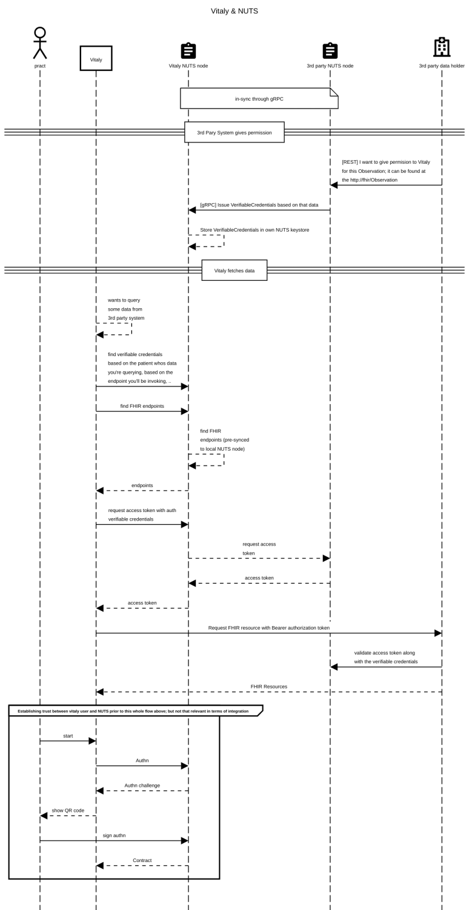
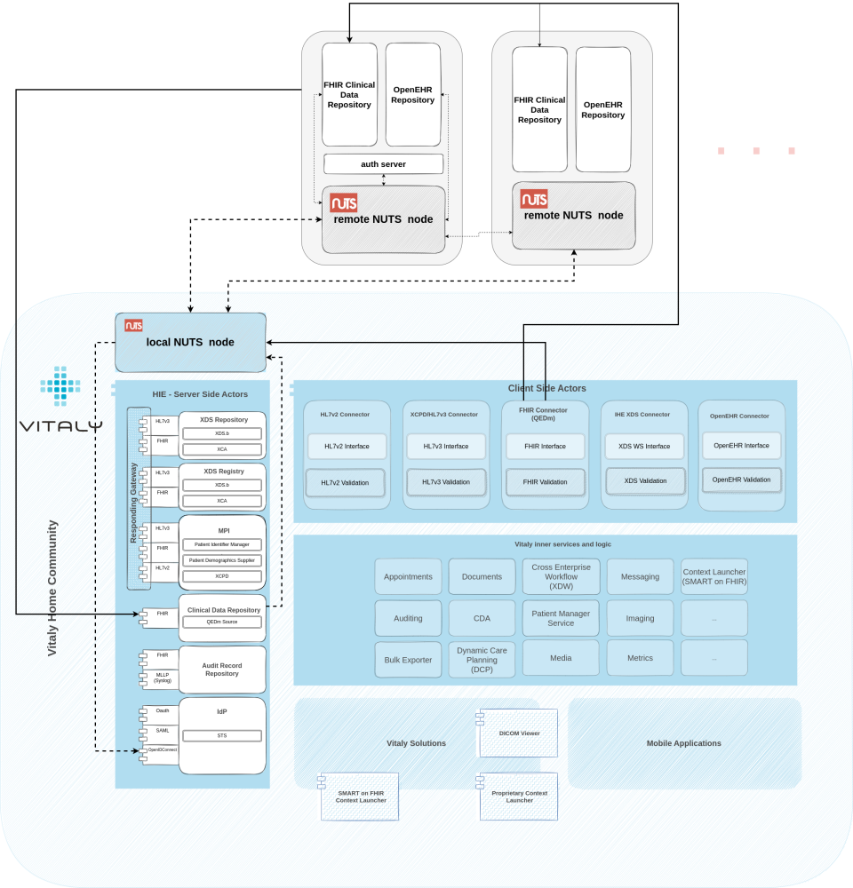

## Introduction

Our strong presence in the Netherlands market forces us to stay up to date with new development that is happening in the
ecosystem and lately, there’s been a big shift happening towards a decentralized infrastructure called hashtag#NUTS.
It’s not really new per-se, as the initial position paper was written in 2018, but that in the hashtag#digitalhealth
years means is still quite new.

In short – and I’m sure some of you reading this have better ways of describing it, which I’d kindly ask you to actually
do so in the comments below – NUTS is a joint initiative by healthcare software suppliers to develop an open-source
protocol that regulates access to healthcare data.

How does it work? Well it’s based on W3C Verifiable Credentials Data Model. Whenever clinical data is exchanged, the one
sharing it creates a unique key that tells you:

who is allowed to view the data,
what can be viewed and
where the actual data can be found.

That key is then transferred to the intended recipient of that clinical data (i.e. specialist) – or rather to his NUTS
node (NUTS nodes are decentralized.. each system has one*).

When the person (i.e. specialist) is trying to access that data, all restrictions are verified and data can successfully
be viewed exactly by the person and in a way intended. Furthermore, patient can know exactly when the unique key was
used and can even retract the permission and thus manage authorizations (authorization credentials, i.e. consents ) for
his clinical data.

It’s a way how nuts enables secure and safe exchange of clinical data entirely in the control of the patient or the
referrer.

Emphasis on the secure and less on the ‘exchange’. The ‘exchange’ part has been solved by many already and can already
be taken for granted, whereas making it be secure in the very foundation of the standard and the patient having total
control of his or her data – well that’s new and very much needed.

Not trying to say other initiatives and standards don’t have this built in, but I think the difference here is that this
open standard is all about that, whereas other have security and privacy as an add-on and perhaps up to the implementer
to implement properly. But with NUTS.. well you can’t spell NUTS without security, can you! (I know, I know..)

## How it works with Vitaly

Our solutions are all about the data and how to leverage data to support the use cases we are covering. So naturally,
without the data exchange – without data going from our platform as well as obtaining data from other systems – our
solutions can’t function properly and can’t achieve their true potential.

And NUTS being all about secure data exchange, we naturally have to place it at the very core of all transactions that
are happening.

Whenever our system would want to obtain data from other sources (other EMRs, other HIEs, FHIR servers, OpenEHR
repos, ..), the following happens:

First, 3rd party FHIR server/system (data holder) needs to issue credentials (VerifiableCredentials = authorization
credentials, i.e. consent) for data to our solution (our local NUTS node); pieces information in there are: (1) who can
view data, (2) what data can be viewed and (3) where that data is available.

All these three pieces of information are then signed and represent a "key" created by their (data holder's) keystore.
That key is stored within our keystore (via NUTS gRPC syncing).

Once our solution tries to fetch the data we were given permission for (given VerifiableCredentials), the key is checked
as well as the identity of our solution. If all checks out (nothing has been tempered with and we are actually allowed
to see the data, as per VerifiableCredentials), we can fetch that data from the 3rd party FHIR server.

Consent is ensured. If anything is tempered with, it automatically prevents data sharing. It’s secure. It’s seamless.
It’s audited. It’s built in. It’s magic.

## NUTS network
As mentioned, NUTS is decentralized. Each system or each organisation have their own NUTS node that together with others
in the ecosystem form a network of these little, powerful secure blocks that build a foundation for secure data sharing.
Those nodes communicate with one another following gRPC, which is a modern open source high performance Remote Procedure
Call (RPC) framework that can run in any environment.

You set up a local NUTS node and connect it to all other nodes in the environment. NUTS nodes talk to one another
following the gRPC so you only care about integrating/talking to your own NUTS node, whereas the synchronization between
NUTS node is happening automagically by NUTS nodes themselves.

Integration with your NUTS node is RESTful based and uses the w3c vc-data-model. For example you use REST interactions
with NUTS for the following things:

* issuing authorizations (authorization credentials) to someone else to view the data within your system,
* fetching access-token for accessing the data in a 3rd party system,
* validating an access-token,
* searching for endpoints where some specific data is available,
* finding authorizations (authorization credentials) issued to you,
* .…

## How it positions in our architecture

So us being one of the pieces in the architecture, which both consumes and produces clinical data, we need to have our
own local NUTS node. As mentioned above, our internal services communicate with the local NUTS node via a RESTful
interface, while NUTS node itself communicates with other in the architecture the way it knows best.

Integration points to the local NUTS node are basically two; one is our Clinical Data Repository with it's integrators
talking to NUTS and the other is our IdP talking to NUTS.

When our CDR talks to NUTS, it's for the following reasons:

* finding endpoints of integrated systems,
* requesting access tokens before going to 3rd party systems,
* depending on the final design, also may be to validate incoming requests,
* our endpoint registration,
* issuing authorizations (authorization credentials) to other systems,
* finding authorizations (authorization credentials) issued to us

and when our IdP talks to NUTS:

* issuing access tokens when other systems are accessing our clinical data repositories and
* depending on the final design, may also be to validate incoming requests.

## Proof of Concept Setup

For the proof-of-concept setup, I've setup two NUTS nodes and combined them in a cluster - one representing our local
NUTS node and another representing a 3rd party NUTS node. They have a nice and easy to follow tutorial written out for
that, so that wasn't the hard part.

It was a bit harder to understand how everything works, though. Party because I wasn't familiar with the W3C Verifiable
Credentials Data Model and party because some relevant NUTS documentation is still in dutch.

At the end, though, I managed to setup a demo environment, covering all functionalities relevant to us, so:

* registering and configuring a NUTS node
* registering and configuring an organization within a NUTS node
* registering FHIR and oauth endpoints within an organization and enabling them (broadcasting orgs and endpoints
* throughout the network)
* issuing, revoking and viewing all authorizations (auth credentials // verifiable credentials, i.e. consents)
* requesting access tokens and validating access tokens
* ...

## What's next

I think it's only a matter of time before projects and the market forces us to polish this proof-of-concept integration
and embed it deeply within our platform, thus further extending interoperable capabilities of our core - something with
which we are able to integrate into existing health information backbones and actively participate in a secure data
exchange, while doing our best to empower our end-users who are able to leverage obtained clinical data. 