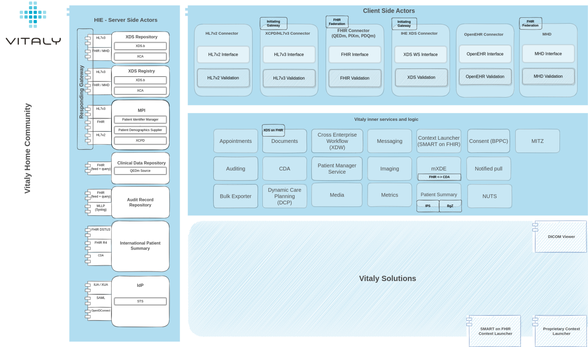
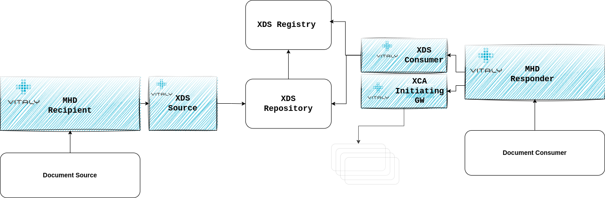
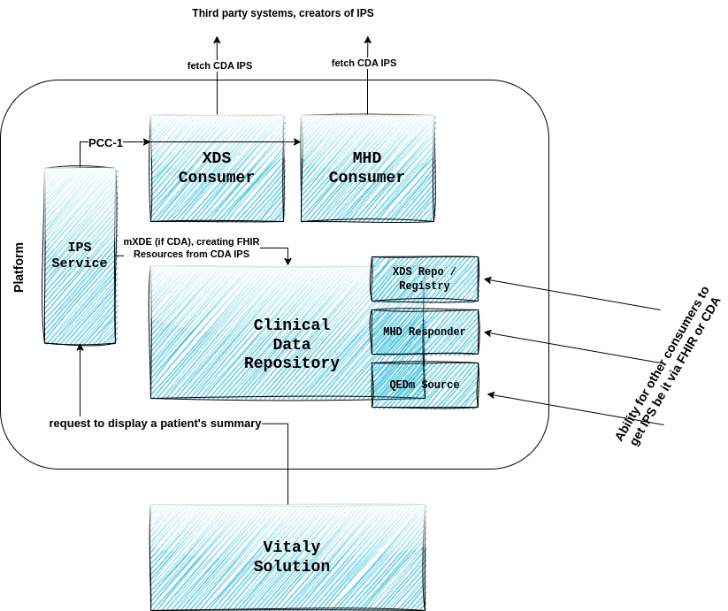
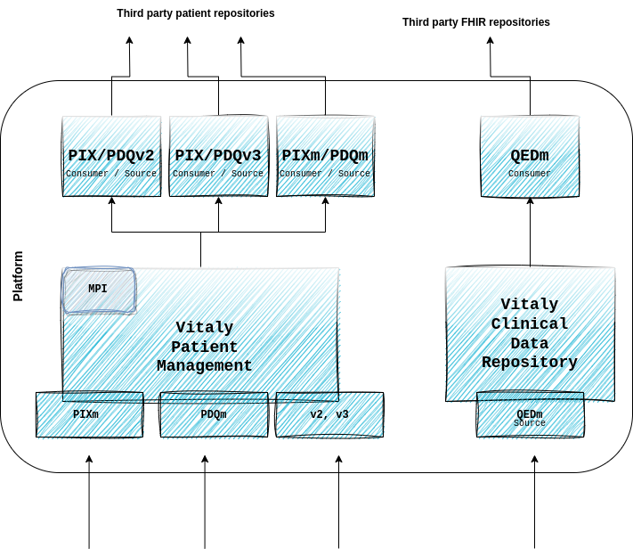
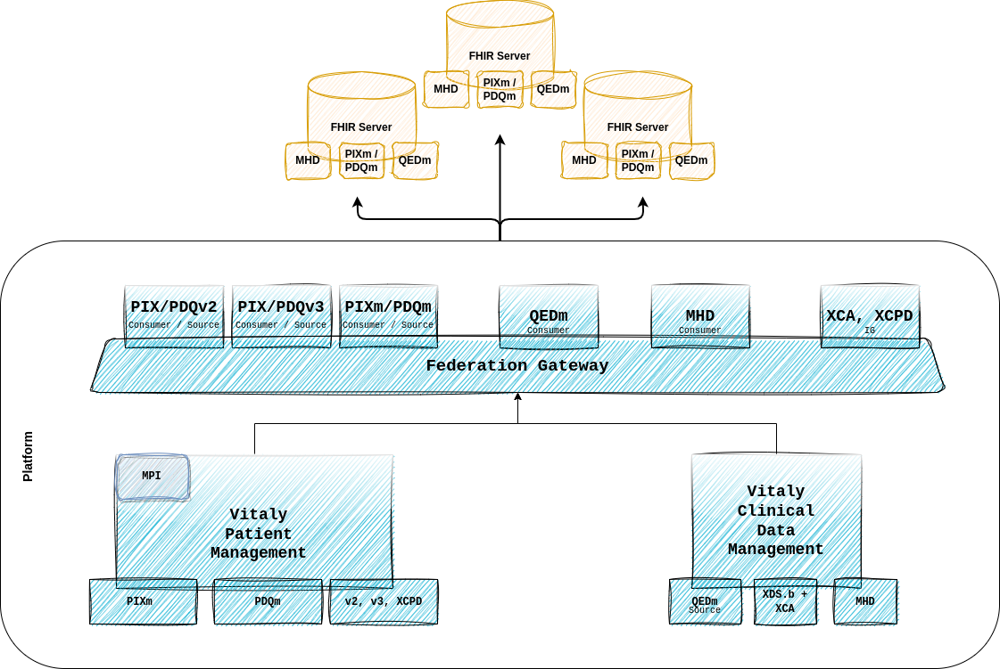

## Introduction

A couple of weeks ago, we attended an adrenaline sporting event - the IHE Connectathon in Rennes.

An amazing experience for our team, both in terms of what we've learned and what we've achieved, as well as the number
of people and other vendors we've gotten to know. Norepinephrine, adrenaline, and dopamine ensured.

But underneath it all, the purpose of our attendance was not only because we, as a team, lacked adrenaline and stress.
It was, in fact, to validate our platform and its interoperable core.

So, a couple of weeks after the event, I'm proud to say that full compliance to profiles and options we've been able to
implement and validate has been successfully productivized and is now part of our standard platform.

A description of some of these - those that I think are going to play an important role in the upcoming months and years
in the world of digital health - follows below.

It is not a full description of what our interoperable core offers - that list is a lot longer - but summarizes
capabilities we've added to our platform as a result of the work in the last couple of months preparing for the
Connectathon.

## MHD & XDS on FHIR

The ability of our platform to exchange documents has been one of the most important ones since the beginning of time.

Users of our frontend-facing solutions being able to look at documents in connected systems and leverage them for
clinical decision-making throughout our workflows is something we've never taken lightly, therefore support for XDS.b
and XCA has been there from the start.

But a couple of years ago - at that time, for the preparation for the 2018 Connectathon in Venice - we also started
looking into the FHIR parallel of the XDS called MHD.

Since then, MHD has been improved and changed to be aligned with the new FHIR version(s) and more aligned with real
production requirements of the data exchange.

Enter this year - with the shift we're seeing in the markets we're present in towards FHIR, we've decided to revisit our
whole MHD compliance and implement it fully.

With that, Vitaly Platform is able to be any (or all) of the following:

👉 MHD Document Source - being able to publish documents our users upload or our platform generates in an MHD compliant
way to third party system

👉 MHD Document Consumer - integrating into existing MHD registries to empower our users with documents that reside
externally

👉 MHD Document Responder - exposing our documents to any other system that would be interested in what our platform
generates

👉 MHD Document Recipient - being able to accept documents from other sources

## ..the transition
 
But the real power of our platform - in my opinion - for the next couple of years of transitioning from XDS towards
FHIR (or not necessarily transitioning but just both co-existing) is the ability of our platform to be a little of both
and to provide transformation from one to the other - option called XDS on FHIR.

Being compliant with XDS on FHIR means that our platform can accept MHD documents and transform them into XDS Provide
and Register transactions, and accept MHD queries and transform them into XDS Registry Stored Queries.

This means we can play an intermediary role between all those systems that are FHIR but not XDS compliant. It also means
we're able to be a facade to existing XDS architectures that would want to expose their functionalities through the
modern FHIR.

_Vitaly XDS on FHIR capabilities_

## International Patient Summary

Through the use cases we provide, Vitaly can be an important source of patient's clinical data and, thus, a participant
system among those building a patient's summary.

For that data to be shareable with others, we have support for the International Patient Summary and can generate a
patient summary in FHIR (DSTU3 and R4) format and in a CDA.

Likewise, the ability to import an IPS to our Clinical Data Repository in any of those formats is also there (with the
help of mXDE).

Together with XDS, MHD and QEDm profiles, we also have a variety of ways of getting that data in and out of our system (
closely following sIPS development).

## CDA and mXDE
The ability to fetch and render CDA has been one of our features for a while.

With this major upgrade and the support of IPS CDA, we have also added support for mXDE and can create FHIR Resources
from a CDA that are later available via QEDm transactions.

Again, being able to play an intermediary role between CDA, XDS and FHIR, QEDm. Magic.

## QEDm, PIXm, PDQm
FHIR from the DSTU2 times has been deeply embedded in the core of our platform, so from the very beginning of Vitaly1.0,
we were already able to expose clinical data that we produce in a standardized FHIR way.

So, there were no major extra steps that needed to be done in order to support FHIR Profiles for clinical data and for
patient data exchange. But IHE profiles always have some bits and pieces you don't normally support unless you
deliberately do it, and this is something we've done now.

Our platform's ability to integrate with other FHIR servers has been validated and is now just one of many other ways
how we empower our end users with external data throughout our workflows.

## FHIR Federation

The more FHIR is gaining traction, the more we're seeing a need for some kind of a FHIR Federation.

While this hasn't strictly been tested at the Connectathon, with the QEDm and MHD consumers we are slowly implementing
support for a FHIR gateway as well.

A component of our platform that would be able to accept a single query and multiply it against several other FHIR
servers, all while taking care of different authentication mechanism each one of those would require, different context
propagation, terminology, semantics, ... and then simultaneously trying to put everything it gets back on a common
denominator, so the consumer of the gateway lives in the ignorance of the federating magic that has happened.

## XDS.b(+I), XCA(+I), XCPD
Arguments are being made that these dinosaurs are passé, but from what we're seeing, this is far from reality.

Surely, other standards are eating into the share XDS/XCA had years ago, and while it's true the scale may tip one or
the other way, I doubt we're near the extinction of these species.

That's why this year, we've validated once again all our XDS components and even added compliance to server-side actors
as well - therefore, Vitaly can be any or all of the: Registry, Repository, Initiating GW, Responding GW, Consumer,
Source, ...

## Vitaly juggling UX and Interoperability

Being a use-case-driven company that primarily focuses on the value we bring to our end users, we're never supporting
new standards and profiles just for the sake of it.

Whatever we support, we support because it makes sense to do so for our vision and for our end users.

We understand that integration alone presents no meaning, and likewise, functionalities without the integrated data are
useless.

Imagine having a perfect user interface with the best workflow ever but without the documents, patients, and clinical
data that exists in a hospital information system. No one would use it.

Similarly, if you have support for all IHE acronyms that exist but don't have a good use case behind it, what value does
it really bring?

Therefore, we are always trying to have a balance between the two. Standards that make sense for our solutions and
integration options that empower our end-users on their journey through Vitaly. With these extended capabilities we've
added to our platform, we've definitely done a huge step forward in that regard.