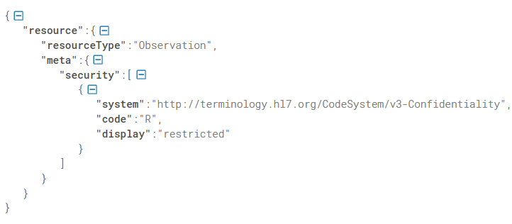
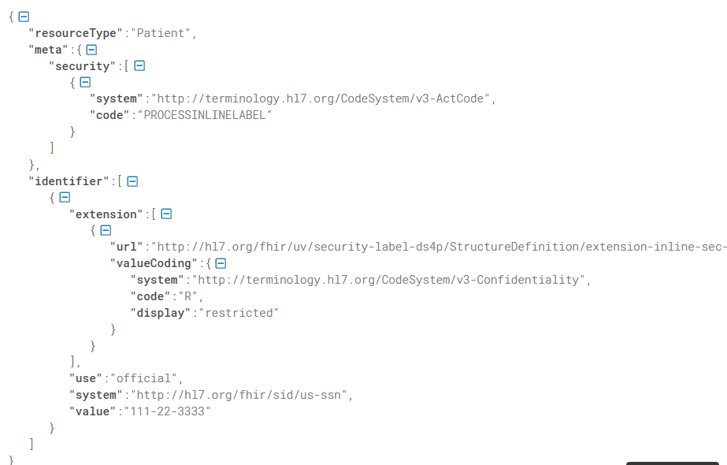
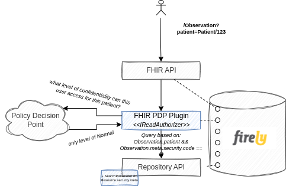
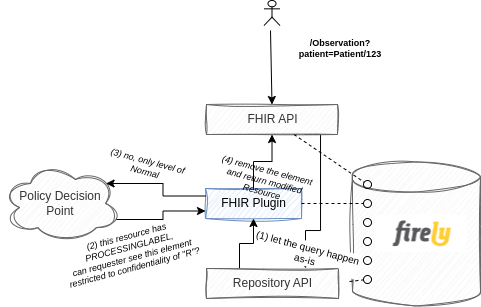
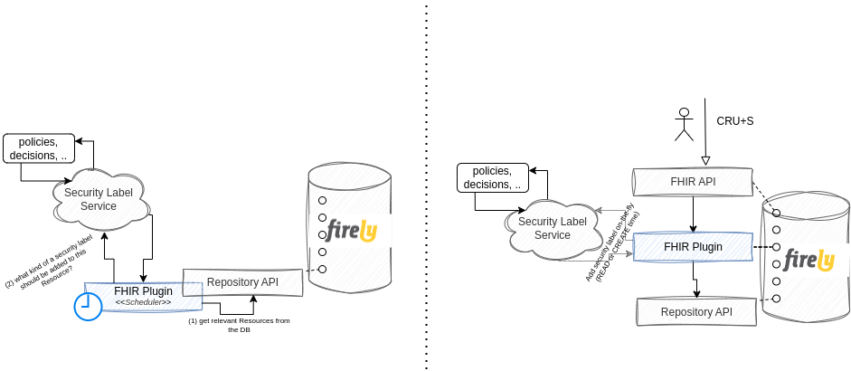
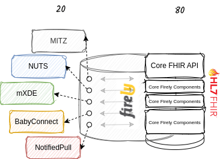

## Introduction

Learning through practical experience is a great thing - even more so, when you can apply a real life scenario to it.
Couple of days ago I stumbled upon
this [LinkedIn thread](https://www.linkedin.com/feed/update/urn:li:activity:7183386454197161984?commentUrn=urn%3Ali%3Acomment%3A%28activity%3A7183386454197161984%2C7183389956499775488%29&replyUrn=urn%3Ali%3Acomment%3A%28activity%3A7183386454197161984%2C7183399947352895489%29&dashCommentUrn=urn%3Ali%3Afsd_comment%3A%287183389956499775488%2Curn%3Ali%3Aactivity%3A7183386454197161984%29&dashReplyUrn=urn%3Ali%3Afsd_comment%3A%287183399947352895489%2Curn%3Ali%3Aactivity%3A7183386454197161984%29&lipi=urn%3Ali%3Apage%3Ad_flagship3_pulse_read%3BIzYPF8YaRruOcwyAIIGsJw%3D%3D)
from Darren Devitt and Joost Holslag about the security labels
and consequentially the [FHIR Data Segmentation for Privacy (DS4P) Implementation Guide](https://build.fhir.org/ig/HL7/fhir-security-label-ds4p/).

This is an implementation guide that is not out of the box supported by the Firely FHIR Server - nor can it be, as it's
a matter of the whole infrastructure you have around it - so I gave myself a challenge to see how easy it would be to
implement a small part of it in form of the Firely Server plugin. Simplifying of course the missing architecture
components (Policy Decision Point, Security Labeling Orchestrator, ..).

## Envisioned use case

Implementation Guide is really extensive, so for the PoC I've decided to implement a really simple use case - being able
to enforce confidentiality security label both on the level of a Resource(.meta.security) as a whole as well as on
specific elements of a Resource. This is, to say that a certain resource as a whole can be removed from the response if
confidentiality label of it is not sufficient. Similarly, that a Resource is modified in a way that certain restricted
elements are removed from it before returned in the response.

Resource.meta.security

inline security label

## Writing the plugin

Firely server has a built-in mechanism for extending it's functionalities called "Plugins". There are several available
off-the-shelf, such as SMART on FHIR, Subscription, Terminology, ..., but if you have more specific needs,
implementation guides, national specifics or use cases you'd like supported, you can easily write your own.

The use case I've (purposefully) chosen for this PoC required me to write my own.

Applying restriction based on Resource.meta.security required me to do two things:

(1) [add an additional search parameter](https://docs.fire.ly/projects/Firely-Server/en/latest/features_and_tools/customsearchparameters.html) (create a Conformance Resource called SearchParameter with expression
ResourceType.meta.security, i.e. Observation.meta.security). This meant my instance of the FHIR Server now had support
for searching based on this custom search parameter otherwise not specified by the core FHIR spec. Mind you this is
completely acceptable practice of the FHIR implementation, as just like with the data model, search parameters too
follow the 80/20 rule. No coding was required to achieve this - a new indexable search parameter available on the FHIR
Server just like that.

(2) implement a custom **IReadAuthorizer** service (Firely Server library thing). Business logic of this custom
implementation would then ask a Policy Decision Point (PDP) what level of confidentiality can this specific user access
and add additional search parameter accordingly.

For example if an ophthalmologist goes for your Observations (/Observation?patient=Patient/123) and the PDP says that
whoever is not your GP can only see resources with confidentiality code of "normal", the plugin will make sure an
additional restriction (search parameter) is added when searching against the FHIR CDR. Consequentially, this specific
query would result in a search based on the patient (as provided in the query) AND based on the
Observation.meta.security (added by the plugin).

A couple lines of codes was all that was required to achieve this and with that, the Firely Server was able to enforce
restrictions based on the resource's security label.

## Inline Security Labels

Inline security labels require a bit different approach, since resource as a whole still needs to be returned and
searched by, it just needs to be modified before it's returned to the consumer.

A plugin that modifies search parameters is therefore not sufficient. You want the CDR query to be done according to the
received FHIR query and only then check if and what needs to be modified.

To avoid too much of a performance impact that would be introduced if you were to check every single Resource for all
elements if they have an inline security label, you can rely on the PROCESSINLINELABEL tag that is specified by the DS4P
IG.

Business logic would therefore be roughly like:

(1) process FHIR query as is

(2) check if a returned Resource has a PROCESSINLINELABEL meta security code.

(3) only those that do are checked for inline security labels and processed correctly (i.e. removed attributes that
don't match the required level of confidentiality).

## Adding security labels

Another important implementation of the IG is adding security labels. This can either be done outside of an actual
transaction (offline, periodically), or on the fly. This is to invoke a Security Labeling Service (SLS) that determines
and assigns labels to FHIR resources before they're stored to the CDR (or added on the resource before they're returned
to the requester, but that delegates responsibility of properly handling it to the requester).

Either of those can be achieve with a Plugin - if you'd like to manage security labels periodically on all already
stored resources within your CDR, you'd implement an Infrastructural plugin that would run scheduled jobs - ask a
Security Labeling Service periodically to give you latest and greatest security label for a specific data point (
policies can change over time) and store it accordingly.

If you'd like to enrich resources with the proper labels on the fly, you'd just as simply add a plugin that would
intercept the request, call the SLS and return enriched Resource to the requester.

## 20% of the 80/20 rule

Its extremely easy to modify the behavior of a Firely server and make use of the 80/20 rule that FHIR was built on. If
you have a specific use case (BabyConnect? NotifiedPull?), national specifics (BgZ), additional frameworks (NUTS, MITZ)
or just a wild idea completely individual to you, creating a custom plugin and adding it to your process is a really
simple thing to do. And if you're ever stuck, the beauty of the open source community really comes to life - FHIR as it
is and Firely .NET SDK out of which Firely Server is comprised of.

