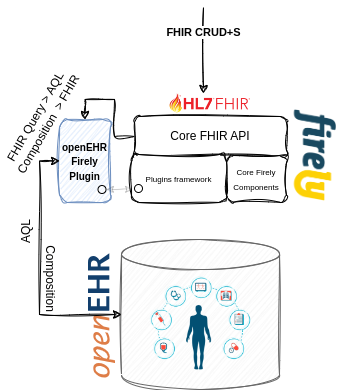
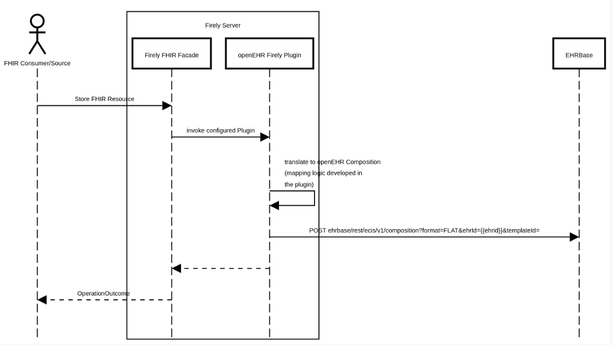
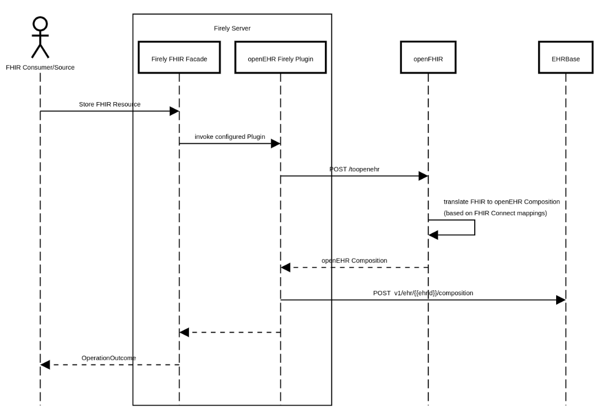
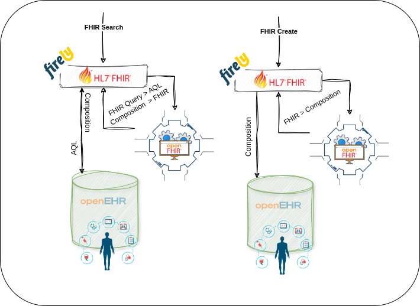

## Introduction

As the healthcare ecosystem evolves, we're hearing more and more about the combination of FHIR and openEHR. Just as no
single standard has dominated in the past (think HL7 v2, v3, CDA), it's reasonable to assume that neither FHIR nor
openEHR will become the sole standard of the future. Instead, both will find their unique roles, each excelling in what
it does best.

Currently, there seems to be a consensus: FHIR excels at data exchange and dramatically accelerates time-to-market for
use case-specific applications. On the other hand, openEHR shines in data persistence, offering a framework for
future-proofing data models, ensuring vendor neutrality, and truly supporting a "data-for-life" philosophy.

While FHIR enjoys broader adoption, especially with governmental agencies driving its implementation across healthcare
systems, the growing traction of openEHR is impossible to ignore. Its value lies in its forward-looking approach to data
modeling, focusing on long-term, reusable health information.

However, this is all theoretical unless we can translate it into practice. To effectively implement a hybrid approach,
FHIR and openEHR solutions must not only coexist but communicate seamlessly. Without interoperability between the two,
you're left with two isolated data silos - missing the opportunity to leverage the best aspects of both. Only by
integrating their strengths can we truly realize the full potential of these standards in modern healthcare.

## Flexibility of Firely Server

As I've mentioned in one of my recent posts about extending Firely Server for DS4P, the solution is highly flexible and
configurable. Through custom plugins, it allows developers to tailor the server to meet specific use cases, scale
solutions, and - most importantly for the purpose of this discussion - integrate it with a broader ecosystem.

So how can it live in an architecture that requires both FHIR and openEHR?

## Proof of concept integration - EHRBase, Firely

To validate this proof of concept integration, I set up a local instance of EHRBase and implemented a custom plugin
within Firely Server capable of interacting with it. This plugin bridges the gap between FHIR and openEHR, enabling the
two systems to communicate and exchange data effectively within the same architecture.

By doing this, we've created an environment where FHIR handles the interoperability and data exchange while openEHR
manages the persistent data layer. This hybrid approach not only ensures data longevity but also maximizes the strengths
of both standards, bringing us closer to a more unified, future-proof healthcare ecosystem.

Firely Server is configured as a facade, meaning it can route all or selected requests to the custom plugin instead of
relying solely on its own FHIR database. This setup allows Firely Server to act as a gateway, while delegating specific
tasks to other systems—in this case, openEHR.

This is where the openEHR Firely Plugin comes in. Within the plugin, Incoming Resource is mapped over to an openEHR
Composition. Essentially, it's nothing more (although this minimizes the importance, which in reality is far from tiny
and simple) than a mapping logic with an HTTP Client pointing towards the EHRBase instance.

Since there is no .NET reference implementation for openEHR that I am aware of (unlike the Archie library for Java),
EHRBase’s ability to accept Compositions in a flat format became particularly useful. The plugin generates the flat JSON
representation of the Composition and sends it over to EHRBase.

## openFHIR

To further streamline this integration, the addition of a dedicated component for mapping — [openFHIR](https://syntaric.com/#openfhir) — makes the separation
of concerns even clearer. With this approach, the openEHR Firely Plugin delegates the complex task of mapping FHIR
Resources to openEHR Compositions to the openFHIR Engine, which is designed specifically for that purpose.

The plugin’s role becomes significantly simplified: it simply invokes the openFHIR Engine to handle the conversion and
mapping, and then uses the existing HTTP client to send the resulting Composition to EHRBase. By offloading the mapping
logic to a specialized component, the plugin's implementation is reduced to handling HTTP communication, while all the
transformation complexity is encapsulated within openFHIR.

This modular approach enhances both scalability and maintainability, allowing the system to be more flexible and
adaptable for future needs. Additionally, it doesn't require a .NET reference implementation of openEHR and doesn't
require any kind of mapping logic to be in code.

## Pragmatic architecture?

FHIR’s ability to accelerate interoperability and data exchange, combined with openEHR’s focus on long-term data
persistence, offers a powerful framework for healthcare ecosystems. Extending Firely Server with a Plugin and an
openFHIR engine, we can create systems that are adaptable and designed to meet the complexities of real-world healthcare
scenarios.

This is likely the future of healthcare architecture - one where different standards and technologies work together
seamlessly, each playing to its strengths. The proof of concept shows it's possible and the technology is there, but -
it is, however, still a question of proper semantic mappings between one and the other - a much more complex issue that
technology can not solve.