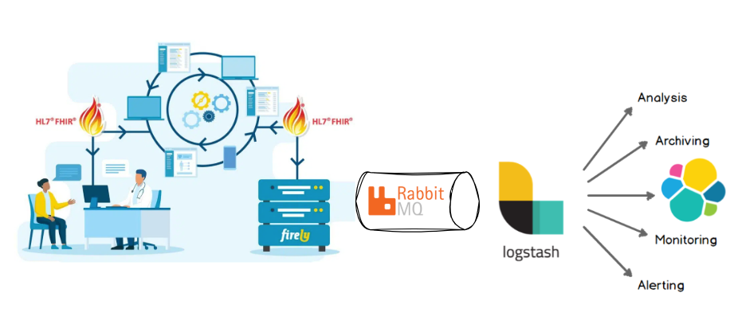
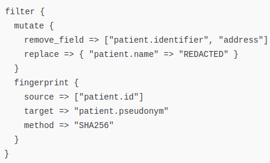
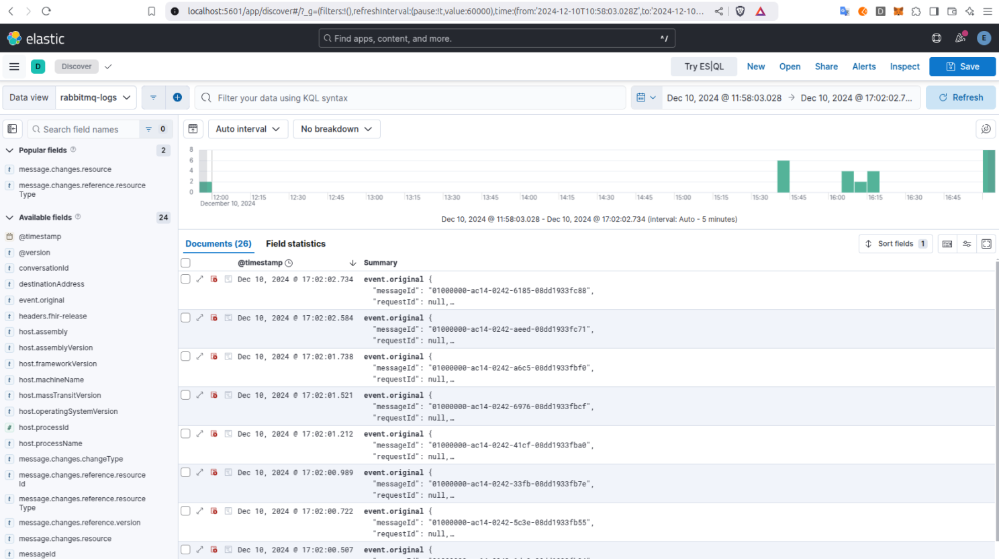
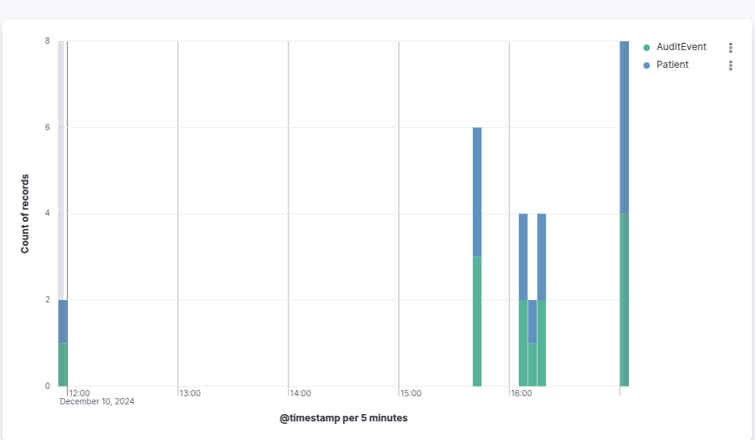

## Introduction

Running analytics and reporting directly on a production database, particularly one serving as a clinical data
repository, can create significant challenges and risks that impact both system performance and data management.
Clinical systems must maintain high availability, reliability, and speed to support critical real-time operations, such
as patient care and clinical decision-making.

When resource-intensive analytics processes are executed directly against the production database, they can interfere
with the system's responsiveness, slow down vital queries, and even cause database locking, preventing essential
clinical transactions from completing in a timely manner.

Moreover, clinical data often includes sensitive patient information that must be carefully managed to meet privacy
regulations and ensure data security. Performing analytics on this data without proper anonymization or governance
introduces risks around unauthorized access and potential breaches of confidentiality.

In this article, I will shed light on these challenges and present an alternative architecture built around the Firely
Server. This setup incorporates services such as Elasticsearch, Logstash, Kibana and RabbitMQ.

## Performance

The performance of the Firely Server largely depends on the setup, scale, and administration of the underlying database.
It supports SQL Server, SQLite, and MongoDB, and is designed to take full advantage of specific database
functionalities (indexing, sharding, ..) to maximize performance. It is important to know though, that it adheres
strictly to the FHIR specification, which also introduces certain boundaries. A clear example of this is the use of
predefined query parameters specified by FHIR. These parameters are appropriately indexed (even custom Search
Parameters), ensuring that queries executed against them are both fast and efficient.

Trying to squeeze an analytics or reporting use case into this setup is like forcing a square peg into a round hole -
you’re setting yourself up for a tough time. Any modifications you make to accommodate analytics would likely be for all
the wrong reasons. The principle of separation of concerns is clear: the Firely Server is designed to support primary
use cases, while a dedicated architecture built around it should handle the secondary analytics workload.

## ELK

ELK stands for Elasticsearch, Logstash, and Kibana. This stack is designed specifically for searching, analyzing, and
visualizing large volumes of data in real time, making it an ideal solution for reporting and analytics use cases.
Unlike a FHIR server, which is built to handle clinical data for primary use cases, the ELK Stack is purpose-built to
process and present data efficiently for secondary tasks like analytics and reporting.

So, how can we leverage this with Firely Server?

## RabbitMQ

The Firely Server, out of the box, supports integration with a messaging queue through its Firely PubSub feature. By
leveraging this integration, you can seamlessly export events to an analytics warehouse with minimal to no performance
impact on the production system.

The PubSub feature supports two specific types of events:

- **ResourcesChangedEvent**: This event includes the full FHIR Resource along with additional metadata, which is added
  to the
  messaging queue.
- **ResourcesChangedLightEvent**: This lighter event includes only key information about the Resource (but not the
  Resource
  itself), making it more efficient for scenarios where full Resource details are not required.

Using RabbitMQ in this setup allows for reliable and scalable message handling, enabling real-time or near-real-time
processing of data for analytics without burdening the Firely Server or the underlying database.

## Architecture

When a request comes through, the Firely Server processes it as usual but, in parallel, also adds it to the messaging
queue (e.g., RabbitMQ) using its PubSub feature. On the other end, Logstash is subscribed to the queue and acts as a
powerful data processor. With the wide range of functionalities Logstash offers, you can handle the data however you
need - be it anonymization, extraction, transformation, or any other operation required to tailor the data for your
analytical or reporting use case.

Then comes Elasticsearch, which serves as both a data storage solution and a powerful search engine that drives Kibana's
visualization capabilities. After Logstash finishes its logstashing (processing, transforming, and/or enriching the
data), it sends the processed data to Elasticsearch for indexing and storage.

## Visualization

Last but not least comes the most important part - making use of all this data. Enter Kibana, the visualization
powerhouse of the stack. Kibana offers an almost overwhelming array of features to help you make sense of the data
you've just stored. With Elasticsearch underneath, the queries you perform are crazy fast, and most importantly, they
have zero performance impact on the FHIR server itself, as this entire process is isolated from the core clinical data
repository. Additionally, users accessing this data can see and analyze it safely, as any sensitive information has
already been removed or anonymized during this whole process.

## Conclusion

This is just one of many ways of how you can complement Firely Server with peripherals and suit many use cases at once.
It is important to know more tools so you don't end up making compromises that would impact sensitive information flow.
When your only tool is a hammer, you tend to see every problem as a nail. For setting up the ideal architecture, you
sometimes need to look outside the box and Firely Server, with a wide variety of plugins and integration capabilities,
is able to play an active role in such a diverse setup.
