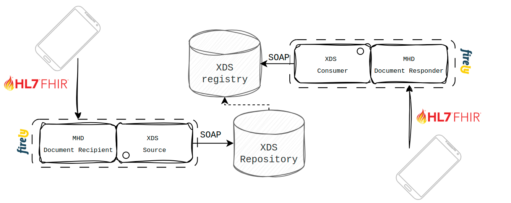
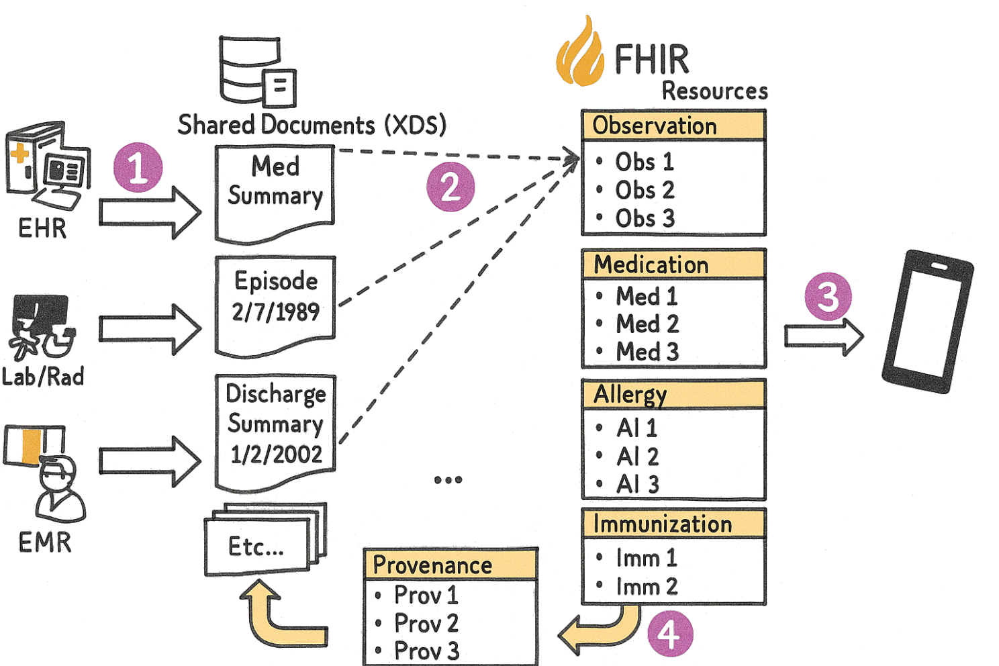

## Introduction

Despite a strong move towards FHIR, XDS is still widely used for exchanging - primarily unstructured - clinical
documents across Europe. In the Netherlands alone, 58 out of approximately 70 hospitals participate in XDS-based
document and imaging exchange. Nationally, over 180 million documents have been indexed through XDS networks, including
61 million radiology (DICOM) studies, 56 million lab results, 46 million narrative reports, and 11 million patient
consents (source: Founda Health).

In the northern provinces of the Netherlands, XDS document exchange grew from 76,000 in 2015 to over 1 million per year
by 2021, across just nine hospitals serving around 1.6 million people. Notably, smaller hospitals contributed to 57% of
the shared imaging studies in that region (PMC article).

Similar trends are emerging across Nordic countries, where Denmark, Finland, and Norway are deploying cloud-native XDS
infrastructure to support regional and municipal data sharing, often leveraging public cloud platforms like Azure (
Nobly). While adoption varies in other EU countries, XDS remains a backbone of clinical document exchange in many
national health systems. As a result, it continues to serve as a critical complement to FHIR, especially for
large-scale, unstructured document workflows that remain central to patient care.

## FHIR

Similarly, FHIR adoption is rapidly accelerating worldwide. According to the 2025 State of FHIR Survey with 82 expert
respondents from 52 countries - 71% reported active FHIR use in at least some use cases, up from 66% in 2024. Nearly
half of countries now have a national FHIR implementation guide, and about half have a FHIR-based terminology server -
showing both policy momentum and growing infrastructure maturity.

While IHE XDS remains a robust and well-established standard for Cross-Enterprise Document Sharing, it relies on a
dinosaur technology stack - including SOAP and WS-* protocols - that can be cumbersome in modern environments. As
healthcare IT moves toward RESTful, API-driven architectures, there's a clear shift toward FHIR native alternatives that
offer greater flexibility, scalability, and developer-friendliness.

## Mobile Access to Health Documents (MHD)

This is where IHE MHD (Mobile access to Health Documents) comes into play. MHD defines how XDS-like workflows can be
implemented using FHIR RESTful APIs, enabling FHIR servers like Firely Server to participate in document exchange
ecosystems.

A FHIR server essentially exposes the XDS infrastructure through a modern API, enabling FHIR native applications to
leverage modern standards and actively participate in XDS based exchanges. The following actors are defined by MHD
Implementation Guide:

### Document Source & Consumer

This would be a FHIR native application that follows the relevant FHIR implementation guides to either produce documents
or query for existing ones in the XDS Registry.

When publishing a document, there are several compliance options available to the document source, but in essence, the
metadata must be aligned with what XDS expects under the hood. You can read more about the required semantics
here: https://profiles.ihe.net/ITI/MHD/ITI-65.html#2365412-message-semantics

### Document Recipient

This is where a FHIR server comes into play. Document Recipient exposes counter-actor to the client side Document
Source. Meaning it needs to be able to accept a Bundle containing submission of a document and interact with XDS. When
accepting and validating a given Bundle, it assumes the role of an XDS Source and interacts with the XDS Repository.

ITI-65, which is a FHIR MHD transaction, in turn becomes an ITI-41 (XDS Provide and Register), essentially storing FHIR
Document produced by the source in the XDS infrastructure.

### Document Responder

Another actor assumed by a FHIR server is a document responder. This is to support querying of XDS documents in a FHIR
way. Document consumers would trigger FHIR Document Reference (or List) search queries, and the mentioned document
responder would translate this into an XDS ITI-18. Returned soap response would be transformed to FHIR Resources,
abstracting away the complexity of the XDS infrastructure from the FHIR client.

## Firely Server

Both Document Recipient and Document Responder roles can be effectively supported using Firely Server, thanks to the
flexibility offered by its plugin framework. Firely Server is built with extensibility in mind - it allows you to hook
into the request and response lifecycle at multiple levels, making it well-suited for acting as a gateway between FHIR
native clients and legacy XDS infrastructures.

Using Firely’s plugin architecture, you can:

* Intercept incoming requests, such as POST transactions involving FHIR Bundle submissions (ITI-65), and transform them
  into the corresponding XDS Provide and Register (ITI-41) operation.
* Similarly, you can intercept FHIR search queries (e.g., GET /DocumentReference?patient=...) and map them to ITI-18 XDS
  Registry Stored Queries
* Once the SOAP-based XDS response is received, the plugin can transform it back into standard FHIR resources, such as
  DocumentReference, Binary, List, .., abstracting away the complexity for the FHIR consumer

This makes it possible to treat Firely Server as a FHIR façade over an XDS system, either as an interim step towards
modern architecture all together or even as a hybrid approach where both FHIR and XDS based systems co-exist.

## mXDE & QEDm Profiles

A logical next step, especially when XDS-on-FHIR is viewed as an interim solution for scaling up structured data
exchange, is to introduce support for mXDE and QEDm.

These two IHE profiles enable FHIR actors to extract specific data elements from structured documents (such as CDAs,
typically exchanged via XDS) and map them into discrete FHIR Resources. This allows systems to expose those resources to
FHIR queries, thus accelerating the shift from a document based XDS exchange to a fully FHIR data exchange model.

Similarly as above, Firely Server can take on this role, either extracting CDA on the fly (following a similar design
pattern as described above, with plugins), or via a more async ETL approach, where CDAs would be loaded and parsed
outside of a request context as part of a migration from CDAs to native FHIR. This would require a separate component to
do the business logic and then interact with Firely Server in any of the available way to load data into it (FSI, bulk
import, RESTful API, ..).

## Hybrid Architecture

The rigidity of the healthcare landscape makes any kind of revolutionary change difficult. That’s why, at least in the
medium term, hybrid approaches are far more viable than a full-blown transformation. It’s especially important, then, to
have components that can act as gateways during this interim phase... or even as long-term solutions. In some cases, a
setup that combines a well-functioning XDS layer with FHIR on top may not just be a temporary workaround, but a fully
capable architecture that meets all our requirements.
