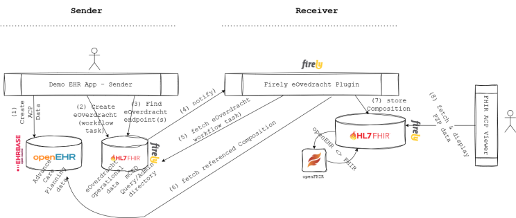
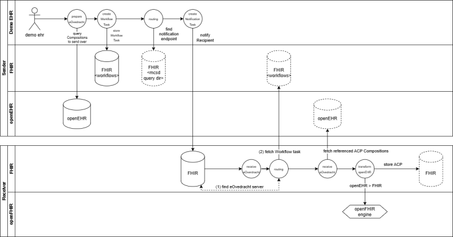
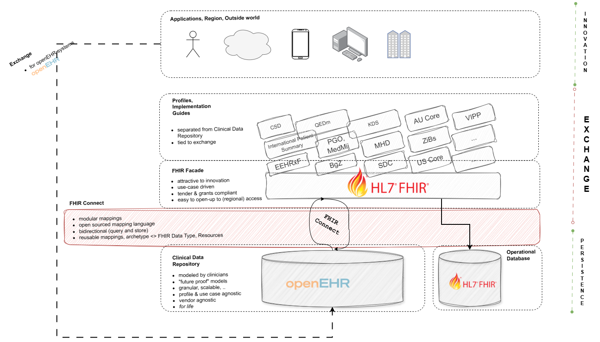

## Introduction

To pique your interest, some of the keywords in this article are: _mCSD, generic functions, FHIR, openEHR, ACP, and
eOverdracht_. There’s also a local setup, real code, and a demo at the end - for those who prefer running things over
admiring them, feel free to scroll past the wall of text to the video at the bottom.

## Context

[eOverdracht](https://informatiestandaarden.nictiz.nl/wiki/vpk:V4.0_FHIR_eOverdracht) is the national standard for the structured digital transfer of nursing and care information between
healthcare providers in the Netherlands, ensuring continuity of care across settings by using standardized datasets and
semantics.

We have FHIR Implementation Guides that describe how this care handover is realized using HL7 FHIR profiles, but how
does that work in a hybrid architecture that includes openEHR?

To prove this can work, I’ve started a proof-of-concept architecture with working components, validating how the
following concepts can be combined and mixed-and-matched:

* mCSD & Routing generic functions that we are currently developing as part of an
initiative (https://build.fhir.org/ig/nuts-foundation/nl-generic-functions-ig/care-services.html)
* ACP on openEHR
* ACP on FHIR (something that PZP coalition is actively working on)
* eOverdracht
* FHIR Connect to support the hybrid architecture

_tldr: all this works nicely with a UI to test it out and is available
here: https://github.com/syntaric/eoverdracht-openehr with a docker compose, a readme and everything you need to set it
up and click by yourself. If you need help, I'm happy to help._

## Architecture

Architecture I wanted to validate was a hybrid one, where a referring organization uses openEHR (and FHIR), whereas the
receiving organization uses FHIR only. It may make more sense to have it the other way around, but that's besides the
point - the main goal was for me to prove that systems can use different standards and still be able to contribute to
the overall patient journey.

To put it in layman's terms, in eOverdracht you have a sending side and a receiving side. In my architecture, I've setup
EHRBase on the sending side together with a Firely Server for operational data (such as eOverdracht Workflow task and
mCSD models).

On the receiving side, I explored the idea of having only FHIR available for both clinical and operational data. For all
intents and purposes, this could simply be a FHIR API on a proprietary system (or on top of an EHR).

Data flow is simple:

* sender creates an ACP Composition and stores it in its own openEHR CDR
* when wanting to refer to the receiver, you create a FHIR Workflow task (as per eOverdracht IG)
* you find the right healthcare service (all according to the mCSD and Routing IG)...
* ... and notify the receiver.
* Receiver on the other side - after being notified fetches that FHIR Workflow tasks, takes the referenced Composition (
representing the ACP as it currently exists)...
* ... and reads it from sender's openEHR CDR.
* It then maps it to FHIR (because the receiver uses FHIR) and stores it in it's own FHIR repository.
* Receiver user is then able to view sender's openEHR data in the FHIR viewer.

Data flow
.. or a more sexy representation of the data flow with some more nuances and details

## Key concepts

The following key concepts worth mentioning are validated through this architecture approach:

### mCSD and routing generic functions
As you may have stumbled upon, in Netherlands we are currently specifying and developing something called generic
functions. Generic functions act as reusable building blocks for health data exchange, so instead of solving the same
technical problems repeatedly within each system, these shared functions provide a common foundation for capabilities
like querying, addressing, and secure communication, consent, etc.

One of the generic functions I've tested with this architecture is that of care service discovery and routing.

Firely server is used as an admin and query directory, syncing to a fake LRZA where it gets addressing entities from
the 'receiving' side of the architecture.

### openEHR plus FHIR in eOverdracht

Another idea I wanted to test out is one that we've validated a couple of months ago at a PZP hackaton already - that is
whether openEHR ACP data model can be used together with a PZP implementation guide for advanced care planning.

I wanted to test how it would be possible to participate in a longitudinal patient journey where systems are differently
capable, namely when one system wants to use openEHR as storage of data, whereas the other not (but provides a FHIR
API).

To test this out, this PoC sets up a local EHRBase from vitagroup and a server from Firely , with a needed local
openFHIR mapping engine in between that leverages already written FHIR Connect mappings for bidirectional mapping (see,
I used all the words).

Firely eOverdracht plugin which accept a notification and resolves Workflow task from the sender FHIR server, READs the
Composition and triggers openFHIR to map it to FHIR Resources. Then it stores those FHIR Resources in the receiving FHIR
server.

### Vendor neutral architecture
The architecture we have set up is completely vendor neutral, as it is built on open standards rather than proprietary
technologies or integration engines. This approach gives organizations the freedom to evolve without being locked into a
single supplier or platform.

At the bottom, as a foundation to everything - you have a properly modelled, future proof and use case agnostic openEHR
CDR. But at the same time, you have FHIR API on top, which allows your third party application ecosystem to grow and to
provide use cases to your end users.

Middle layer - FHIR Connect - makes it possible for you to add new use cases and support implementation guides currently
in fashion, all without doing any kind of changes (read: extensions) to your core clinical data repository at the
bottom.

You're welcome to take a look and play around yourself: https://github.com/syntaric/eoverdracht-openehr

If you’re interested in a proof of concept similar to this, adapted to your use case, architecture and deployed to your
servers, feel free to reach out.