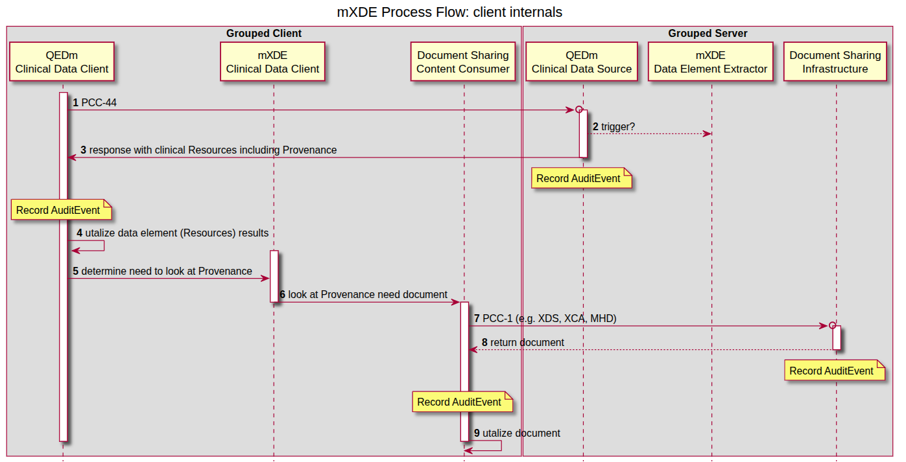
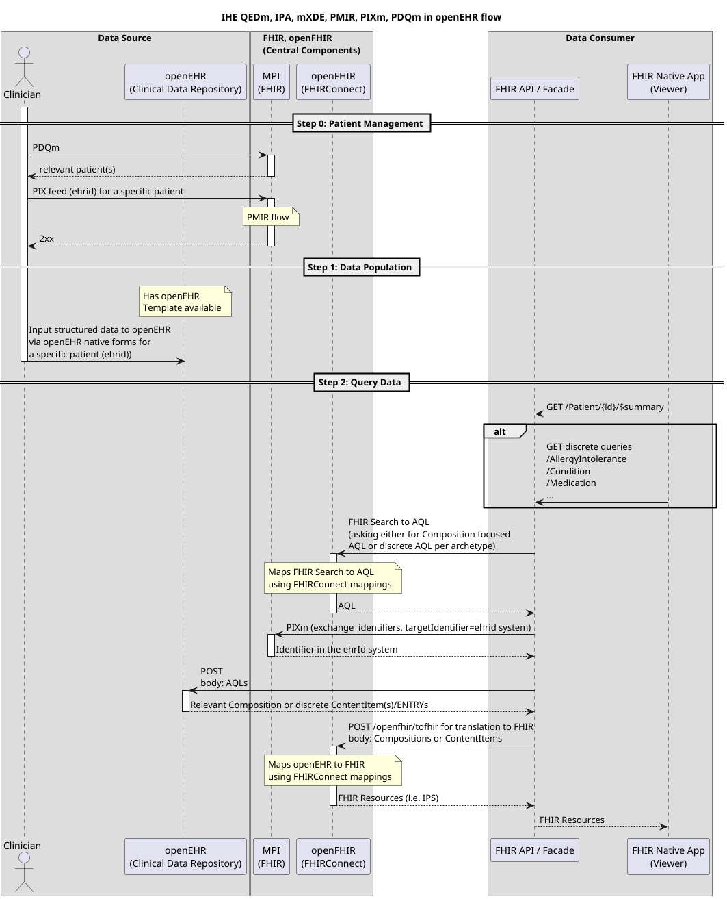

## IHE and openEHR

Integrating the Healthcare Enterprise (**IHE**) is an initiative by healthcare professionals and industry to improve how
medical systems share information. Rather than creating new standards, IHE promotes the coordinated use of existing
ones, such as HL7, DICOM, and FHIR through “profiles” that specify how systems should interact. These profiles
enable **interoperability** between electronic health records, imaging systems, and other healthcare applications,
ensuring consistent, secure, and efficient data exchange across organizations.

**openEHR** is an open standard and specification for managing electronic health records. It separates clinical
knowledge
from technical implementation using a two-level modeling approach: a stable reference model and flexible archetypes
defined by clinicians. This allows systems to store, share, and interpret health data consistently over time. openEHR
emphasizes semantic interoperability, enabling different healthcare systems to understand and reuse clinical information
accurately across organizations and applications.

## The Gap

IHE primarily focuses on interoperability and the exchange of information between systems, rather than on how data is
stored internally. IHE profiles define workflows, transactions, and communication patterns using standards like HL7 and
DICOM, ensuring that systems can reliably share data. However, IHE provides little guidance on persistence mechanisms or
detailed information models. Decisions about how data is structured, stored, and managed internally are left to
individual implementations.

And this is the gap: openEHR is fundamentally about defining a thorough information model that is
reflected in persistence itself, not just in how data is exchanged. Relying on interoperability at the exchange layer
alone risks losing the semantic richness that is of utmost importance in healthcare. Yet IHE has always been about
that, which isn't a weird thing, right? You can't force healthcare vendors to conform to _your idea_ of information
model _just_ to be able to exchange data. But it is where openEHR adds it's true value and is an important aspect in
the future health IT world we're moving towards - a data-centric one, instead of a vendor-centric one, where
interoperability
is built in its core rather than an add-on.

## Plugathon

openEHR International and IHE set out to do a _Plugathon_ in the Connectathon week in Brussels, with the idea of
identifying
potential collaboration opportunities and existing (or new?) IHE profiles where openEHR could be one of the standards.
Immediate areas of exploration were MHD, mXDE and QEDm profiles and how they work with openEHR foundation underneath. We
furthermore decided to focus on EHDS and IPS use case to make it more tangible.

### QEDm

..stands for Query Existing Data (mobile - signaling that it follows a RESTful pattern). It describes the behavior of a
client
and a server-side component when one is querying for discrete data from (for example) an IPS section. Apart from
describing
the transactions, it furthermore describes how Provenance is tracked, what security considerations need to be obeyed, and
what are the responsibilities of each actor. When one of the actors is an openEHR CDR (for server-side component), there
are various
details that could be specified, bringing the whole QEDm closer to openEHR _stack_ and making it a standard actor
grouping.

### mXDE

..goes hand in hand with QEDm, because it's all about how data is extracted from a structured data source (say: openEHR)
and then exposed via QEDm. In the sequence diagram below, mXDE and "_Document Sharing Infrastructure_" would be a role
for openEHR CDR bundled with a FHIRConnect engine (such as [openFHIR](https://open-fhir.com)). mXDE and QEDm profiles could further specify how
the extraction and transactions look like when structured clinical content is openEHR. And a good first use case for
this
could be International Patient Summary (in EHDS landscape).

(source: https://profiles.ihe.net/ITI/mXDE/volume-1.html#145432-grouped-client)

## Added value of openEHR

An obvious question out there is why openEHR and why would we try to bridge that gap between IHE and what is essentially
a standard for persistence (simply put, I know it's not really that). Why would IHE include this standard in one of
those
used in IHE profiles, if _all that matters is exchange_? QEDm is QEDm, it's an exchange and defined in FHIR regardless
of how
data
is actually represented at the source (in our case that would be openEHR), right?

That's true.. to a point. And we could leave it at that, and openEHR could just be one of many data sources that has a
FHIR facade on top,
which is entirely possible now with a [FHIRConnect](https://sevkohler.github.io/FHIRconnect-spec/) standard. But the obvious added value of openEHR means that with it,
you
have a **standard, reproducible and scalable stack based entirely on open standards**. A vendor-neutral architecture where
both
information model and the exchange is standardized, community driven and interoperable out of the box, easily scalable
in all
possible dimensions - between vendors,
between nations and furthermore easily scalable to other use cases. It's no longer about adding an exchange layer and
proprietary mapping of _your data_, but **being interoperable at-source**. Adding this whole stack to an IHE profile is no
longer about
putting a plaster on proprietary systems for the reason of exchange, but making a fundamental shift towards how open
vendor-neutral
systems should look like in the future (and can now, already).

There are many hospitals (..) that are looking at IHE compliance by vendors when choosing their system. And IHE
compliance
of a vendor is the next best thing, because it still promises some sort of interoperability and solution to a vendor
lock-in,
but it stops at that.. it stops at the bare minimum. What if there was an IHE profile completely mandating these
three open standards (FHIR, FHIRConnect and
openEHR) based on which vendors would 100% be able to deliver a vendor-neutral architecture, and not just a plug on the
proprietary system, sufficing with the bare minimum to get the _ribbon_ of being interoperable? Having that kind of _ribbon_
as
a vendor, and IHE proving that kind of capability is next level and would truly mean something to a hospital or a care
provider.

## Architecture

A couple levels deeper, this is how data flow would look like when openEHR acts as a Data Source in an architecture of IHE
compliant actors (PIXm, PDQm, mXDE, QEDm, ..) that leverage FHIR. If you want to know more, feel free to ask [Seref Arikan, PhD](https://www.linkedin.com/in/seref-arikan)
about an ["EHR Slice"](https://www.linkedin.com/feed/update/urn:li:activity:7446890913676562432).

## Key focus points

The plugathon was filled with discussion, but we always came back to what's the first use case we're trying to solve.
What's the first tangible problem that needs addressing? EHDS, IPS, and how the above profiles relate to them were our
main focus points and the area of collaboration we plan to further deep dive into in upcoming newly established work
group meetings.

But there is another idea: one where openEHR and FHIR together form a unique selling proposition for how forms are
governed and used. It’s an idea that’s been ironed out in Igor
Schoonbrood’s [whitepaper on telemonitoring](https://itcadvies.nl/?p=224), providing
deep insight into how openEHR’s strong data governance and forms bound to openEHR Templates work together with a FHIR
SDC profile. openEHR fits this idea directly, while leveraging FHIR as an already established and widely adopted SDC
profile; perhaps more so than trying to position openEHR within architectures like QEDm. A group of architects and
experts,
primarily in the Netherlands, has been brought together under Igor Schoonbrood’s leadership to evaluate the feasibility
of this as an IHE profile.

## Next steps

Having said that, there are more “focus” points where openEHR brings a lot to the table. But ultimately, this all
circles back to the same idea: interoperability alone, especially when treated as an exchange layer, only gets us so far.

What’s emerging from these discussions is not a challenge to IHE’s role, but an extension of it. If IHE has historically
enabled systems to talk to each other, the next step could be enabling them to mean the same thing at their core. That’s
where openEHR naturally fits in.

In that sense, the question is no longer just how systems exchange data, but what kind of architectures we want to
standardize moving forward and whether interoperability should remain an add-on, or become intrinsic by design.