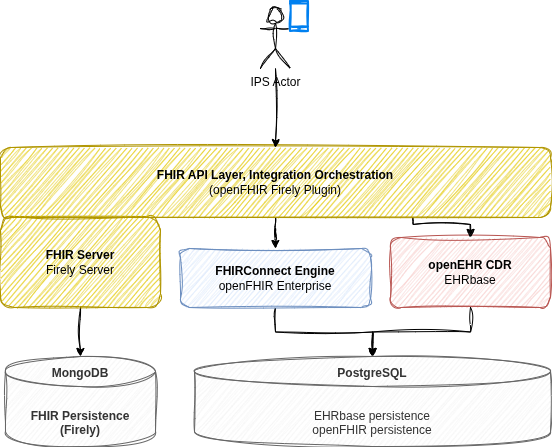
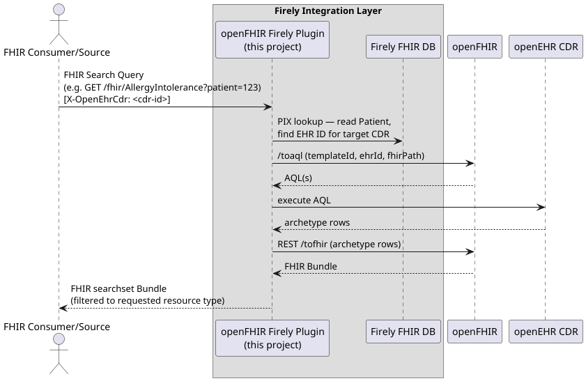
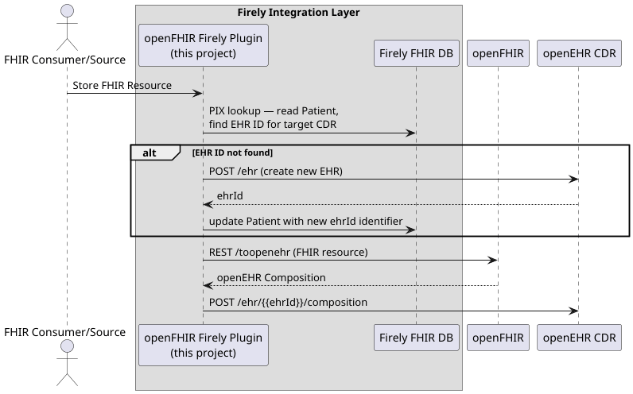
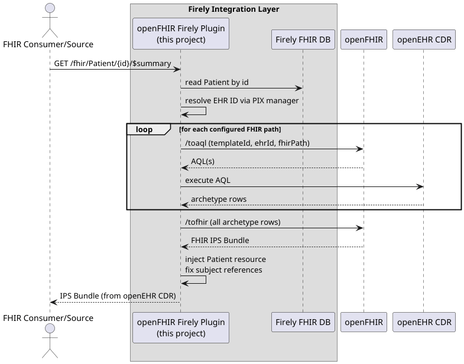

## The Session

**Converge & Collaborate** in Dublin 2026 had a "Let's Build" track, which was a hands-on _unconference_ session where
instead of sitting
through slides, participants actually build something together. The goal was for every participant to have a working architecture based on open standards locally:
something that's able
to expose openEHR CDR data as a FHIR IPS Bundle (and the other way around - store data that comes in as FHIR to openEHR
CDR).

## The Architecture

The idea is not new if you've been following the openEHR and FHIR convergence space, but seeing it assembled end-to-end
in a live session makes it tangible in a way that diagrams alone cannot.

At the core sits an **openEHR CDR** (EHRBase) — the data-for-life persistence layer where clinical content is stored as
openEHR compositions, governed by archetypes. In front of it sits **Firely Server** acting as the FHIR facade, giving
the outside world a standard FHIR API. Between the two sits **openFHIR**, the open-source reference implementation of
the [FHIRConnect](https://sevkohler.github.io/FHIRconnect-spec/) specification, doing the bidirectional translation
between FHIR resources and openEHR compositions.

A **Firely plugin** (plugin is a Firely's way of how to extend standard capabilities of Firely Server) is an interceptor
that decides, based on configurable rules, whether an incoming FHIR
request should be served from Firely's own FHIR store or routed to openEHR CDR. And when creating data,
it decides what gets created in Firely's store and what undergoes a transformation and eventually ends up in openEHR.
The
external FHIR client sees none of this, it just talks FHIR.



```
FHIR client → Firely Server (+ plugin) → openFHIR → openEHR CDR
```

## Walking Through the Steps

> A tutorial we followed is still available here: https://github.com/openFHIR/converge-and-collaborate-dublin-hackaton

It consists of 7 steps that are easy to follow:

### Step 1: Firely Server + MongoDB

The session started by getting Firely Server running locally with MongoDB used for persistence. By the end of this step,
which is merely
putting a couple of docker compose services together, participants had a full blown FHIR server set up locally.

### Step 2: The openFHIR Firely Plugin

With Firely running, the next step was installing the plugin that turns it from a standalone FHIR server into a facade
capable of integrating with openEHR. The plugin ships as a pair of `.dll` files mounted into Firely's plugin directory.

At this point Firely still has no idea where openFHIR lives or what an openEHR CDR is, but the plugin that's able to
integrate with one and the other was then in place.

> Plugin is available here: https://github.com/openFHIR/openfhir-firely-plugin

### Step 3: openFHIR Locally (or the Sandbox)

The openFHIR engine is what actually executes the FHIRConnect mappings. It can be run as a Docker container, reusing
the same MongoDB instance already set up for Firely. For participants who preferred not to run it locally, there was an
alternative: the openFHIR sandbox at [sandbox.open-fhir.com](https://sandbox.open-fhir.com) works just as well and
requires no local setup beyond an account.

### Step 4: Wiring Everything Together

This is the step where the architecture comes alive.

1. Tell the Firely plugin where openFHIR lives (`OpenFhir.BaseUrl`).
2. Point the plugin at an openEHR CDR via a `cdrs.yml` file (configuring openEHR CDRs - participants chose either cloud
   instance of EHRBase provided by Syntaric, their local instance of EHRBase or Better's CDR)
3. Define the routing rules: which FHIR resource types should be intercepted and sent through openFHIR to the CDR
   (`FhirQueryFilter`), and which incoming FHIR payloads should trigger the openEHR store flow (`FhirCreateFilter`).


### Step 5: FHIRConnect Mappings

FHIRConnect mappings are YAML files that express bidirectional relationships between openEHR archetypes and FHIR
profiles. The repository already contained mappings for two IPS sections: problems (`Condition`) and allergies (
`AllergyIntolerance`).

In this step, we looked closely into what FHIRConnect is and how those mappings look like.

### Step 6: End-to-End Test with Existing Mappings

With mappings loaded, the session moved to the first real end-to-end test:

1. [Patient Management Flow] **Create a patient** via `POST /Patient`. The plugin creates an EHR in the CDR and stores the EHR ID back as a
   Patient identifier. That identifier is what the plugin uses to route subsequent requests to the right EHR.
2. [Create IPS] **Ingest an IPS Bundle** via `POST /` with the IPS Composition profile in the bundle. The plugin detects the
   profile, routes the whole bundle to openFHIR, which maps it to an openEHR composition and stores it in the CDR.
3. [Query IPS] **Retrieve the IPS** via `GET /Patient/{id}/$summary`. The plugin queries the CDR via AQL, openFHIR maps the
   composition back to FHIR, and a valid IPS Bundle comes out.






## The Broader Point

Sessions like this matter because they move the conversation from theoretical to operational. The question "can openEHR
and FHIR work together without proprietary glue?" has an increasingly concrete answer, and having a room of
participants build it themselves in a couple of hours is a better demonstration than any whitepaper.

The session repository is public. If you want to run through it yourself, everything is there — including the Step 7
challenge if you want to try writing a FHIRConnect mapping without the session to guide you.

> A tutorial we followed is still available here: https://github.com/openFHIR/converge-and-collaborate-dublin-hackaton
